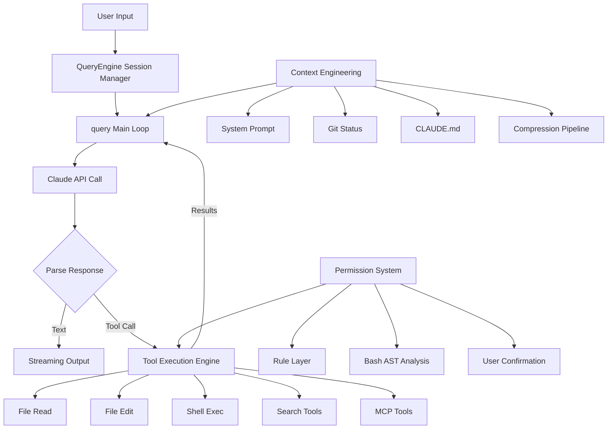

# How Claude Code Works

> One of the earliest structured source code analyses of Claude Code — distilling the agent loop, tool system, and context engineering from the source

[中文](./README.md)

**Not reading notes — architectural abstractions.** This project distills 11 topic-specific documents + architecture diagrams from Claude Code's 500K+ lines of TypeScript source code, giving you the shortest path to understanding this production-grade coding agent.

## Key Design Insights from Source Code

> All observations below come from actual analysis of the 500K+ line codebase — not speculation.

### Architecture
- **The entire system is built on `async function*` generators** — true token-level streaming from API to UI, not "get response then render"
- **React for terminal UI is not overkill — it's necessary** — Full React Reconciler → Yoga Flexbox → Screen Buffer → Diff Detection → ANSI pipeline. Without this, complex interactions with 66+ tools would be impossible with string concatenation

### Agent Loop
- **The loop is a state machine with 7 distinct Continue reasons** — context compression retry, output budget escalation (4K→64K), hook verification loops, etc. Each path has independent recovery logic
- **Recoverable errors are "withheld" — not exposed** — `prompt-too-long` and `max-output-tokens` are held internally while compression + retry is attempted. SDK clients never see errors that were recovered from
- **Tools start executing while the model is still talking** — `StreamingToolExecutor` parses and pre-executes tool calls during the 5-30s streaming window, hiding ~1s of tool latency

### Context Engineering
- **Context compression is a 4-level graduated pipeline, not "compress when full"** — Snip → Microcompact (near-zero cost dedup) → Context Collapse (projection-based, doesn't modify original messages) → Autocompact (last resort, forks a sub-agent for summarization)
- **After compression, the 5 most recently used files are automatically restored** — prevents the model from "forgetting" what it just edited. Budget: 5 files × 5K tokens + all activated skills (25K token budget)

### Security
- **Bash security uses tree-sitter AST analysis, not regex** — 7-layer pipeline including wrapper stripping, env var filtering, AST semantic analysis, 23 static validators (IFS injection, control char detection), sed-specific vulnerability checks
- **Permission dialogs race 3 parallel paths** — UI confirmation, ML classifier auto-approval (~100ms), and Hook validation run simultaneously. First to complete wins, but with 200ms debounce protection against keyboard bounce

### Engineering
- **66+ tools don't all ship in every build** — Bun's `feature()` macro performs compile-time dead code elimination. Internal-only tools vanish entirely from external builds
- **Fast startup via 9-phase parallel initialization** — MDM read and keychain prefetch start during module loading; non-critical tasks defer until after first render. Critical path: ~235ms
- **API 529 retry distinguishes foreground vs background** — user-facing ops retry, background tasks (summaries, predictions) give up immediately to avoid amplifying gateway load

## System Architecture

## Documentation

### Quick Start
- **[Understand Claude Code in 10 Minutes](./docs/quick-start.md)** — Condensed overview of everything

### Deep Dives

| # | Document | Content | Keywords |
|---|----------|---------|----------|
| 1 | [Overview](./docs/01-overview.md) | Problem, tech stack, design principles, directory structure | Architecture |
| 2 | [Agent Loop](./docs/02-agent-loop.md) | The core loop: dual-layer generators, streaming, stop conditions | **Most Important** |
| 3 | [Context Engineering](./docs/03-context-engineering.md) | Context building, 4-level compression pipeline, token budget | Compression, Prompt |
| 4 | [Tool System](./docs/04-tool-system.md) | 66+ tools, execution pipeline, concurrency, MCP integration | Tools, Extension |
| 5 | [Code Editing Strategy](./docs/05-code-editing-strategy.md) | Search-replace vs full rewrite, low-destructiveness philosophy | Editing, Safety |
| 6 | [Permission & Security](./docs/06-permission-security.md) | 5-layer defense, Bash AST analysis, injection prevention | Security, Permission |
| 7 | [User Experience](./docs/07-user-experience.md) | Ink/React TUI, streaming output, Vim mode | UX, Terminal |
| 8 | [Minimal Components](./docs/08-minimal-components.md) | Minimum viable coding agent, progressive enhancement | Build Your Own |
| 9 | [Hooks & Extensibility](./docs/09-hooks-extensibility.md) | 23+ hook events, 5 hook types, PermissionRequest deep dive | Hooks, Customization |
| 10 | [Multi-Agent Architecture](./docs/10-multi-agent.md) | Sub-agents, Coordinator mode, Swarm teams | Multi-Agent |
| 11 | [Memory & Skills](./docs/11-memory-skills.md) | 4 memory types, 18+ built-in skills, cross-session learning | Memory, Skills |

## Key Stats

| Metric | Value |
|--------|-------|
| Source lines | 512,000+ |
| TypeScript files | 1,884 |
| Built-in tools | 66+ |
| Hook event types | 23+ |
| Built-in skills | 18+ |
| Permission layers | 5 |
| Compression levels | 4 |
| Startup phases | 9 |

## Reading Recommendations

**If you have 10 minutes:**
→ Read [Quick Start](./docs/quick-start.md)

**If you want to understand core principles:**
→ Read in order: [Agent Loop](./docs/02-agent-loop.md) → [Context Engineering](./docs/03-context-engineering.md) → [Tool System](./docs/04-tool-system.md)

**If you want to build your own:**
→ Read [Minimal Components](./docs/08-minimal-components.md), then check out [claude-code-from-scratch](https://github.com/Windy3f3f3f3f/claude-code-from-scratch)

**If you care about security:**
→ Read [Permission & Security](./docs/06-permission-security.md) + [Code Editing Strategy](./docs/05-code-editing-strategy.md)

**If you want to customize Claude Code:**
→ Read [Hooks & Extensibility](./docs/09-hooks-extensibility.md) + [Memory & Skills](./docs/11-memory-skills.md)

## Related Projects

- **[claude-code-from-scratch](https://github.com/Windy3f3f3f3f/claude-code-from-scratch)** — A minimal implementation & tutorial of Claude Code's core features, built from scratch

## Contributing

Issues and PRs welcome! If you find an error in the analysis or have a better perspective, we'd love to discuss.

## License

MIT
