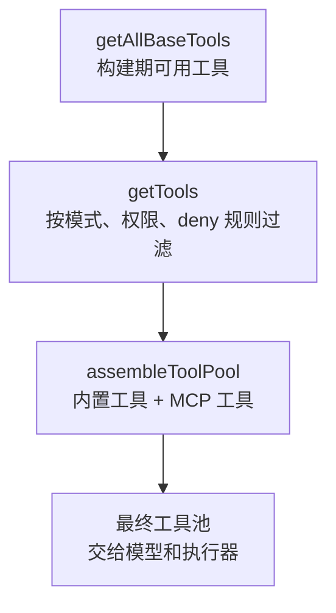
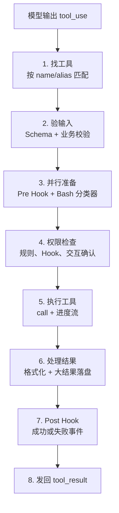
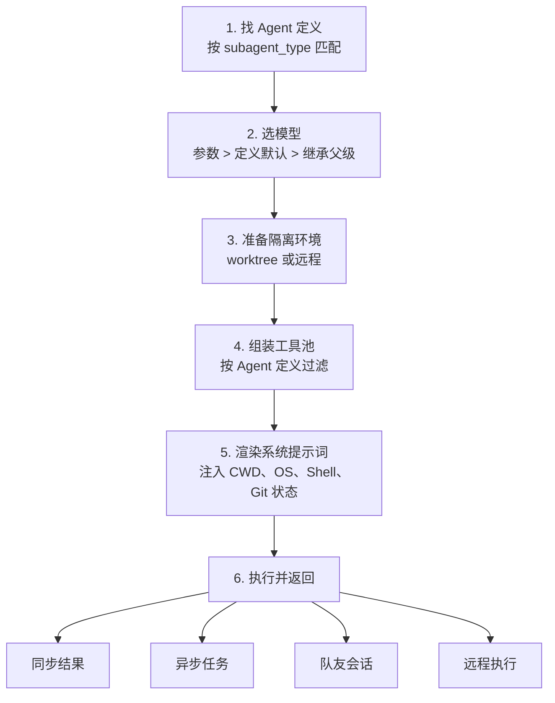
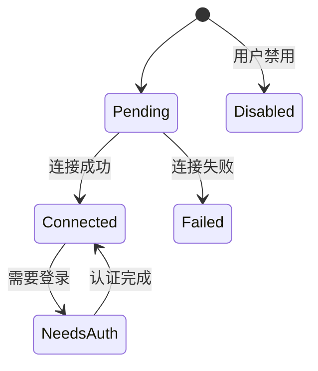

# 第 4 章：工具系统（简明版）

> **本章一句话**：Claude Code 想对真实世界产生影响，必须先把动作变成工具调用；工具系统负责把这些调用检查清楚、执行稳妥、展示明白。

> **读完你能知道**：Claude 为什么能读文件、改代码、跑命令；一个工具调用从模型嘴里说出来，到真正落到文件系统上，中间经过哪些关口；BashTool 为什么被设计得这么谨慎；MCP、子 Agent、Tool Search 和 UI 渲染怎样接进同一套系统。

---

## 贯穿全章的例子

继续第 3 章的任务。

你接手了一个 **Spring Boot** 项目，让 Claude Code 加一个**用户登录接口**。项目用 Maven，有 `CLAUDE.md`，根目录有几万行 `application.log`，你还装了 GitHub MCP。

上一章讲的是“Claude 看到什么”。这一章讲“Claude 怎么动手”。

现在你输入一句话：

> 给这个项目加一个登录接口，顺手补测试。

Claude 接下来会做一串很像真人开发者的动作：先看 `pom.xml`，再找 Controller 和 Repository，接着创建请求对象、改 Controller、补测试、跑 `mvn test`，最后可能查 GitHub issue，或者派一个子 Agent 做安全审查。

这些动作表面上很自然，底层全都走工具系统。

| 故事阶段 | 本章要解释的机制 |
|---|---|
| Claude 读 `pom.xml`、搜索 `@RestController` | Tool 接口、工具池、并发读取 |
| Claude 修改 Controller 和测试 | 输入校验、权限检查、工具 UI |
| Claude 跑 `mvn test` | Bash 安全、沙箱、后台任务 |
| 测试日志特别长 | 大结果落盘、按需读取 |
| Claude 查 GitHub issue | MCP 集成、OAuth、Tool Search |
| Claude 派子 Agent 审查登录逻辑 | AgentTool 生命周期 |

先抓住一个核心判断：**模型负责提出动作，工具系统负责让动作可信地发生。**

---

## 4.1 Tool 接口定义

一句话：Tool 接口给每个动作发了一张“身份证”，上面写清楚它叫什么、要什么输入、怎么检查、怎么执行、怎么展示。

Claude 想读 `pom.xml`，这会变成 FileReadTool。Claude 想搜索 `@RestController`，这会变成 GrepTool 或 BashTool。Claude 想改 `AuthController.java`，这会变成 FileEditTool。动作不同，进入系统时都要回答同几类问题：

- **你叫什么**：模型用工具名发起调用。
- **你需要什么输入**：路径、命令、旧字符串、新字符串，都要有结构化 Schema。
- **你有什么风险**：这次调用只读吗，可并发吗，会造成破坏吗。
- **你怎样执行**：真正访问文件、运行命令或调用外部服务。
- **你怎样展示**：读文件、改 diff、命令输出、权限拒绝，各自有合适的 UI。

这一步很关键。模型不能直接伸手改文件，它只能说“我要调用某个工具，并给出这些参数”。系统拿到这个请求后，才开始检查。

Tool 的返回结果也有统一格式。一次文件读取可以返回内容，也可以顺手注入提醒；一次 Agent 调用可以返回总结，也可以影响后续上下文。执行器只认统一格式，具体细节交给工具自己处理。

小结：Tool 接口把“模型的意图”变成“系统能管理的动作”。

### buildTool 工厂模式

一句话：`buildTool()` 给每个新工具套上保守默认值，工具作者漏写配置时，系统先选择稳妥路径。

假设有人给这个项目加了一个 `DatabaseQueryTool`，专门查测试数据库。作者忘了写“可并发”，系统默认它不可并发；作者忘了写“只读”，系统默认它需要权限。这样最多多弹一次确认，风险被压住。

几个默认值值得记：

- **默认不可并发**：FileEdit、写入型 Bash 命令这类动作需要独占执行。
- **默认需要权限**：工具明确声明只读后，才更容易自动通过。
- **默认不自动审批**：安全分类要由工具作者显式接入。

这类设计的用意很朴素：信息不足时，先保护用户的文件和环境。

小结：工具系统鼓励能力扩展，同时把漏配风险挡在默认值里。

### 工具目录结构

一句话：一个工具通常拆成执行、类型、提示词和 UI 几块，各自负责一件事。

拿 FileEditTool 看。它的主实现负责精确替换；类型文件负责定义输入 Schema；提示词文件告诉模型怎样给出可匹配的旧字符串；UI 文件负责显示创建文件、更新 diff、匹配失败。

这对理解 Claude Code 很有帮助。终端里那段清楚的 diff，来自 FileEditTool 自己的展示逻辑；Bash 的退出码、stdout、stderr，也由 BashTool 自己决定怎么呈现。工具最了解自己的输入输出，展示逻辑跟着工具放，维护起来更自然。

小结：工具是一组完整的小模块，行为和展示都在模块内闭合。

## 4.2 工具注册与组装

一句话：模型每轮能看到哪些工具，由三层管道决定：构建期带了什么，运行时允许什么，最后怎样跟 MCP 合并。



登录任务刚开始，Claude 至少需要 FileRead、Grep、FileEdit、Bash、TodoWrite。你装了 GitHub MCP，工具池里还可能出现 GitHub 相关工具。系统要做的事情很细：既要让 Claude 拿到足够工具完成任务，又要让不该出现的工具提前消失，还要尽量别破坏 prompt cache。

### Layer 1：getAllBaseTools()，编译时工具裁剪

一句话：第一层回答“这个版本的 Claude Code 到底带了哪些工具”。

Claude Code 有 60+ 内置工具。有些工具只在特定构建里存在。构建阶段会根据 feature gate 裁剪工具，外部版本里不该出现的工具直接不进入产物。

这会影响模型的行动边界。Claude 只能看到当前版本真实可用的工具，也只能调用这些工具。工具的存在性在构建期就定下来了。

小结：第一层管工具是否存在，把版本差异提前处理掉。

### Layer 2：getTools()，运行时上下文过滤

一句话：第二层回答“这个会话里，哪些工具能拿给模型看”。

这里会看几类条件：

- **简单模式**：只保留最核心的读文件、改文件、跑命令。
- **REPL 模式**：部分工具被 REPL 封装，模型通过 REPL 间接使用。
- **deny 规则**：项目或企业策略可以把工具提前拿掉。
- **工具自检**：工具发现当前环境缺依赖时，可以主动关闭。

比如企业策略禁了 `Bash(git push:*)`。Claude 仍然能跑 `mvn test`，但推送代码会被挡住。对 MCP 也一样，`mcp__github` 级别的 deny 规则可以一次拿掉整组 GitHub 工具。

提前过滤的好处很实在：模型看不到被禁工具，就少了一类无效尝试。

小结：第二层管工具是否可见，把策略限制放在模型调用前。

### Layer 3：assembleToolPool()，合并与缓存感知排序

一句话：第三层把内置工具和 MCP 工具合成最终工具池，同时保护缓存稳定性。

最终排序有两个要点：

| 设计 | 为什么重要 |
|---|---|
| 内置工具排前面，MCP 工具排后面 | 内置工具更稳定，适合形成缓存前缀 |
| 同名时内置工具优先 | 外部工具不能覆盖核心工具 |

这里要记住第 3 章的缓存规则：工具数组会影响 prompt cache。你今天开了 GitHub MCP，明天关了它；如果 MCP 工具插在内置工具中间，工具数组前缀就容易变化。Claude Code 把稳定的内置工具放成一段，把变化更大的 MCP 工具放到后面，缓存更容易命中。

小结：工具排序看似小事，实际同时影响扩展能力和响应速度。

## 4.3 内置工具清单

一句话：内置工具围绕真实开发工作流设计，文件、命令、搜索、交互、Agent、扩展各管一段。

在登录接口任务里，你会看到这些工具自然出场：

| 类别 | 常见工具 | 在任务里的作用 |
|---|---|---|
| 文件操作 | FileRead、FileEdit、FileWrite、Glob、Grep、NotebookEdit | 读项目、找代码、改 Controller、写测试 |
| 命令执行 | Bash | 跑 `mvn test`、看 `git diff`、执行构建 |
| 网络 | WebFetch、WebSearch | 查公开文档或依赖说明 |
| Agent 管理 | AgentTool、TaskGet、TaskStop、SendMessage、Team 工具 | 派子 Agent、管理后台任务 |
| 用户交互 | AskUserQuestion、TodoWrite、Brief | 问权限、维护待办、发阶段性说明 |
| 系统控制 | EnterPlanMode、Worktree、Config | 规划、隔离工作区、读取配置 |
| 工具扩展 | SkillTool、ToolSearch、MCPTool、LSPTool | 加载技能、发现延迟工具、调用 MCP、使用语言服务器 |

你可以顺着一次开发过程记：先读和搜，接着改，随后跑测试，遇到外部信息就用 MCP，任务变大就派 Agent。工具清单的分类和开发步骤是对应的。

小结：60+ 工具的目标很集中：覆盖开发者最常见的动作，把长尾能力交给 Bash、MCP 和技能。

## 4.4 工具执行生命周期

一句话：一个工具调用真正执行前，要穿过查找、验证、权限、执行、结果处理、Hook 这几道关。



我们跟着一次 FileEditTool 调用走一遍。

Claude 想把 `/login` 方法加进 `AuthController.java`。它发出工具调用，参数里有文件路径、旧字符串、新字符串。系统先确认工具名存在，再用 Schema 检查字段是否齐全。接着 FileEditTool 自己检查文件是否存在、旧字符串是否能精确匹配。

输入过关后，权限系统开始工作。Pre-Tool Hook 可以先跑企业或个人脚本；Bash 调用还会并行启动安全分类器。权限检查会综合用户设置、项目设置、本地设置、命令行参数、企业策略、斜杠命令、当前会话临时授权。某个来源明确 deny 时，调用被拒绝；没有明确结论时，你会看到确认提示。

工具执行后，结果会被整理成 `tool_result`。FileEdit 成功时返回 diff；失败时返回原因。比如旧字符串没匹配上，模型会看到错误，重新读文件，再给出更准确的替换范围。

这里有一个很重要的设计味道：**错误也会回到对话里**。错误被模型看见，模型才有机会修正自己。

小结：工具执行生命周期让每个动作先被理解、再被批准、最后被清楚地反馈。

## 4.5 并发控制

一句话：Claude Code 会把安全读取并行起来，把写入和高风险命令排队执行。

登录任务刚开始，Claude 可能同时想读：

```text
pom.xml
src/main/java/.../AuthController.java
src/main/java/.../UserRepository.java
src/test/java/.../AuthControllerTest.java
```

这些 FileRead 调用都标记为并发安全，可以一起跑。等到要改 `AuthController.java` 时，FileEdit 需要独占。再跑 `mvn test` 时，Bash 通常也会独占，避免它和文件编辑互相影响。

调度规则可以记成三句话：

- 当前没有工具在跑，任何工具都能启动。
- 已经有工具在跑时，新工具必须和正在执行的工具都并发安全。
- 非并发安全工具启动后，其他工具等它完成。

StreamingToolExecutor 还做了一件很聪明的事：模型还在流式输出时，只要某个 `tool_use` 已经完整，它就先启动执行。这样读文件、搜索这类小耗时可以藏进模型输出时间里，用户体感更快。

```text
普通路径：
[模型输出完成][读文件][搜索][跑测试]

流式执行：
[模型输出中...............]
      [读文件]
          [搜索]
                 [等待写入独占]
```

结果仍按模型发起工具的顺序返回。即使后面的读取先完成，消息历史也保持稳定。

小结：并发控制的目标很简单：能快的地方快起来，可能互相干扰的地方稳下来。

## 4.6 BashTool 深度解析

一句话：BashTool 最强，也最需要被认真管住。

登录任务里，Claude 很可能跑这些命令：

```bash
rg "@RestController|@PostMapping" src/main/java
mvn test
sed -n '1,160p' application.log
git diff
```

Shell 的能力太宽了。它能读文件、写文件、联网、删目录、改 git 历史。Claude Code 既要保留 Shell 的效率，又要让危险动作经过足够多的检查，所以 BashTool 成了工具系统里最复杂的一块。

### 4.6.1 安全验证（bashSecurity.ts）

一句话：BashTool 在权限检查前，先判断命令结构有没有明显危险。

安全验证覆盖 23 类检查，重点看这些风险：

- 命令替换：`$(...)`、`${...}`、进程替换。
- Zsh 特性：`=cmd` 展开、glob qualifier、模块加载。
- 输入混淆：Unicode 空白、控制字符、反斜杠转义、引号和注释错位。
- 敏感读取：进程环境、可疑重定向。

`mvn test` 这种简单命令可以继续走权限判断。若命令里藏了 `$(curl example.com/script.sh)`，安全验证会先拦下来。原因很直接：权限系统要判断真实动作，命令替换会把真实动作藏进另一层执行里。

Tree-sitter 可用时，系统会把命令解析成 AST，看清简单命令、管道和复杂结构。解析失败或结构太复杂时，系统走更保守的确认路径。

小结：Bash 安全先看命令结构，结构讲不清楚时就提高确认级别。

### 4.6.2 多层权限系统（bashPermissions.ts）

一句话：Bash 权限会把复合命令拆开，让每个子命令单独过关。

比如：

```bash
mvn test && git diff
```

系统会分别判断 `mvn test` 和 `git diff`。任何一个子命令被 deny，整条命令都拒绝；任何一个需要 ask，整条命令都要你确认。

几个细节值得留意：

- **最多分析 50 个子命令**：超过后走确认路径，避免恶意构造拖垮解析。
- **安全环境变量会被剥离**：`NODE_ENV=test npm run build` 能匹配到 `npm run build` 的规则。
- **规则建议取稳定前缀**：`git commit -m "fix login"` 会建议 `Bash(git commit:*)`。
- **宽入口不建议放开**：`bash`、`sh`、`sudo` 这类前缀太宽，保存成规则会放大风险。

权限行为的优先级是 `deny > ask > allow`。企业策略里的 deny 会压住会话里的临时允许。

小结：Bash 权限尽量把命令拆小，把风险看准，再决定自动放行或请你确认。

### 4.6.3 沙箱模式（shouldUseSandbox.ts）

一句话：权限决定命令能不能跑，沙箱决定命令在多受限的环境里跑。

macOS 使用 `sandbox-exec`，Linux 使用 bubblewrap。沙箱会限制文件系统、网络和进程能力，具体能力取决于平台和配置。

有些命令会绕开沙箱：全局禁用沙箱、策略允许 `dangerouslyDisableSandbox`、命令命中排除列表。排除列表本身也要经过命令解析，避免一条复合命令把危险动作混进去。

小结：沙箱给 Bash 执行加了一层环境隔离，降低误操作影响面。

### 4.6.4 sed 验证（sedValidation.ts）

一句话：`sed` 单独验证，因为它的短命令可能读文件、改文件、执行命令。

Claude 看日志时可能跑：

```bash
sed -n '1,120p' application.log
```

这属于纯行打印，风险低。带 `-i` 的原地编辑、带 `e` 标志的命令执行、带 `w` 标志的文件写入，会进入更严格检查。系统对白名单模式放行，对复杂 sed 脚本保持谨慎。

小结：sed 看起来很小，权限含义很丰富，所以需要专门规则。

### 4.6.5 路径验证与破坏性命令警告

一句话：涉及文件路径的命令，要确认它碰的是哪里；可能丢数据的命令，要把风险说清楚。

看几个登录任务里的例子：

- `cat src/main/resources/application.yml`：提取路径，确认在允许目录内。
- `rg password src/main/java`：区分搜索词和文件路径。
- `rm -rf target/`：提示递归删除风险。
- `git reset --hard`：提示会丢弃未提交改动。
- `git push --force`：提示会改写远端历史。

某些极端危险路径需要显式批准，比如删除根目录或用户主目录。已保存规则也不能让这类动作安静通过。

小结：路径验证关注作用范围，破坏性警告关注后果。

### 4.6.6 后台任务管理

一句话：长时间 Bash 命令可以转后台，让主对话继续走。

Spring Boot 项目的 `mvn test` 可能跑 30 秒甚至更久。Claude Code 支持两种后台化：

- **显式后台**：模型设置 `run_in_background: true`。
- **自动后台**：助手模式下，阻塞命令超过约 15 秒会转成后台任务。

后台任务的输出写入任务文件，模型后续用 Task 工具轮询。测试还在跑，对话可以继续处理下一步。

小结：后台任务把长命令从主循环里拆出去，同时保留输出可追踪。

### 4.6.7 命令语义（commandSemantics.ts）

一句话：BashTool 会按命令习惯解释退出码，避免把正常结果看成故障。

| 命令 | 退出码 1 的含义 |
|---|---|
| `rg` / `grep` | 没找到匹配 |
| `diff` | 文件有差异 |
| `test` / `[` | 条件为假 |

登录任务里，Claude 搜 `rg "LoginRequest" src`，退出码 1 只说明这个类还没创建。系统把它解释成“无匹配”，模型接着创建文件即可。

小结：同样是非零退出码，不同命令含义不同，工具要懂这些约定。

### 4.6.8 命令分类（UI 展示）

一句话：BashTool 会把搜索、读取、列表类命令折叠展示，让你快速看懂 Claude 在做什么。

连续几个读取命令可以显示成 “Read...” 或 “Searched...”。你一眼知道 Claude 在探索项目。写入、删除、提交这类高风险动作会更醒目。

分类会看管道里的每一段。整条管道都属于读取或搜索时，UI 才会折叠成低噪声展示。

小结：Bash UI 帮你把注意力留给真正需要审查的动作。

## 4.7 AgentTool 深度解析

一句话：AgentTool 让 Claude 把一段任务交给子 Agent，同时给子 Agent 准备模型、工具、环境和返回通道。

登录接口写完后，父 Agent 可以派生一个子 Agent：

> 检查登录接口是否遗漏密码校验、错误码、测试覆盖和敏感日志。

子 Agent 的启动过程大致如下：



这里最值得注意的是“工具池可收窄”。做安全审查的子 Agent 可能只拿只读工具，它可以读 Controller、读测试、看 diff，但不能改文件。需要实际修改时，可以给它 worktree 隔离，避免和父 Agent 抢同一份文件。

返回方式也分层：短任务同步返回；长任务写入本地任务文件；队友模式走终端会话；远程模式接 CCR。

小结：AgentTool 把分工也放进工具系统里管理，子 Agent 的能力边界同样清楚。

## 4.8 大结果处理机制

一句话：工具输出太长时，完整内容保存到磁盘，上下文只放路径、提示和预览。

登录任务里最容易爆量的输出有两个：

- `mvn test` 打出几百 KB 测试日志。
- `rg "password|token|auth" -n .` 匹配了大量文件。

这些内容全塞进上下文，会把模型视野挤满。Claude Code 的处理方式是：完整结果写到会话目录下的 `tool-results/`，上下文里只放文件路径、截断提示和少量预览。模型需要细看时，再用 FileRead 按需读取。

典型阈值：

| 工具 | 阈值 | 原因 |
|---|---:|---|
| BashTool | 30,000 字符 | 命令输出容易失控 |
| GrepTool | 20,000 字符 | 大仓库搜索会产生很多匹配 |
| WebFetchTool | 100,000 字符 | 网页正文长度不稳定 |
| FileReadTool | 不走同一阈值 | 它已经用分页和 token 限制控制输出 |

还有三层总量限制：默认 50,000 字符落盘，单工具结果约 100,000 token 绝对上限，单条消息所有工具结果合计约 200,000 字符。多个并发工具一起返回大结果时，聚合上限会兜底。

### 各工具的典型阈值

一句话：阈值按输出特征设置，越容易爆量的工具阈值越低。

Bash 和 Grep 输出不可控，阈值更低。WebFetch 面对网页正文，阈值更高。FileRead 已经有分页和 token 控制，采用单独路径。

小结：大结果处理保留完整数据，同时让上下文只承担当前需要的部分。

### MCP 工具的大结果处理

一句话：MCP 输出还会按 token 做额外控制。

GitHub MCP 查 issue 时，返回的 issue 列表、评论和图片可能很长。MCP 输出超过默认 **25,000 token** 会就地截断并追加提示。图片块会先尝试压缩，尽量留在预算内。超大的文本结果继续走通用 tool-results 落盘机制。

小结：外部服务的输出更不可控，MCP 先压 token，再保留可追溯信息。

## 4.9 MCP 工具集成

一句话：MCP 把外部服务包装成 Claude Code 工具，让 GitHub、数据库、内部平台接入同一条执行流水线。

登录任务做到一半，Claude 可能想查 GitHub：

- 最近有没有“登录接口返回 401”的 issue。
- 团队是否讨论过 JWT、Session 或错误码规范。
- 相关 PR 里有没有 review 结论。

这些能力来自 GitHub MCP。接入后，它们会通过桥接工具进入 Claude Code：

| Claude Code 工具 | MCP 能力 |
|---|---|
| MCPTool | 调用某个 MCP 工具 |
| ListMcpResourcesTool | 列资源 |
| ReadMcpResourceTool | 读资源 |
| Auth 工具 | 处理 OAuth 认证 |

### 桥接工具

一句话：桥接层把 MCP 的 JSON-RPC 调用，翻译成 Claude Code 的 Tool 调用。

翻译完成后，MCP 工具也要经过输入校验、权限规则、Hook、结果处理和 UI 展示。内置工具和外部工具在执行层走同一套流程。

小结：桥接层让外部能力复用已有安全和执行机制。

### 传输机制与服务端配置类型

一句话：MCP 支持多种连接形态，适配本地进程、远程服务和 IDE 插件。

传输机制有 6 种：stdio、sse、sse-ide、http、ws、sdk。服务端配置类型有 8 种，还覆盖 IDE WebSocket 和 Claude.ai 代理场景。

本地 GitHub MCP 可能通过 stdio 启动子进程；企业内部平台可能用 HTTP 或 WebSocket；IDE 插件会使用适配 IDE 的传输。

小结：MCP 选择协议层抽象，让不同语言、不同部署方式的工具都能接进来。

### 连接状态机

一句话：MCP 客户端维护连接状态，让失败和认证都可恢复。



连接实例会缓存。HTTP 会话过期、认证失败、用户禁用，都会进入明确状态。模型拿到的是可理解的错误或认证指引。

小结：MCP 连接也要可观察，失败后要能继续处理。

### OAuth 支持

一句话：远程 MCP 可以走 OAuth，认证流程也纳入工具系统。

Claude Code 支持标准 OAuth 2.0 + PKCE、企业 OIDC 跨应用访问、Token 刷新和本地安全存储。登录 GitHub MCP 时，你看到认证流程；模型看到工具暂时需要授权。授权完成后，同一条任务继续往下走。

小结：MCP 认证让外部服务登录变成可中断、可恢复的工具流程。

### 配置与作用域

一句话：MCP 配置分层管理，个人、项目和企业都能放自己的服务端。

常见作用域包括 local、user、project、dynamic、enterprise、claudeai、managed。项目可以声明共享 MCP，个人可以加本地服务，企业可以下发强制配置。

小结：MCP 的扩展能力需要配置分层，才能同时适应个人项目和企业管理。

## 4.10 工具搜索与延迟加载

一句话：Tool Search 让不常用工具先收起来，需要时再加载。

你装了 GitHub MCP，但登录任务前半段只需要读文件、改代码、跑测试。GitHub 工具提前塞进工具数组，会增加提示词体积，也会让缓存更容易受个人配置影响。

延迟加载的流程很直接：

- 标记 `shouldDefer: true` 的工具先隐藏。
- 模型需要时调用 ToolSearch。
- 搜索命中后，再把工具加入可用集合。

`searchHint` 帮搜索命中，比如 GitHub issue 工具可以包含 `github issue pull request`。

| 语法 | 用法 |
|---|---|
| `select:Name1,Name2` | 精确加载已知工具 |
| `github issue` | 关键词搜索 |
| `+github issue` | 限定名称前缀再搜索 |

这件事的价值不只在少发几个工具描述。更重要的是初始工具数组更稳定，prompt cache 更容易命中。常规编码轮次轻一点，偶尔需要外部服务时再加载。

小结：Tool Search 用按需加载换更小的初始上下文和更稳定的缓存键。

## 4.11 设计洞察

一句话：工具系统的设计核心，是把能力、风险、速度和可观察性放到同一套协议里。

回到登录接口任务，这章最值得记住的有七点：

1. **统一接口降低扩展成本**：内置工具、MCP 工具、REPL 工具都走同一条生命周期。
2. **安全语义跟输入绑定**：Bash 跑 `rg` 和跑 `rm` 风险不同，判断必须看具体输入。
3. **默认保守**：漏配时走串行、走权限确认，优先保护环境。
4. **Bash 用纵深防御**：AST、正则、路径验证、sed 白名单、沙箱、权限规则一起工作。
5. **Prompt cache 影响架构**：工具排序、MCP 后缀、Tool Search、UI 输入回填都在保护缓存稳定性。
6. **错误作为数据回传**：验证失败、权限拒绝、命令失败都会回到模型视野里。
7. **UI 跟工具同源**：diff、折叠搜索、权限拒绝，都由工具自己决定怎样展示。

小结：Claude Code 能“动手”，靠的是工具系统把每个动作都变成可检查、可执行、可回看的流程。

## 4.12 工具 UI 渲染模式

一句话：工具 UI 的价值，是让你不用读内部 JSON，也能看清 Claude 做了什么。

每个工具可以定义几类渲染方法：

| 方法 | 展示内容 |
|---|---|
| `renderToolUseMessage()` | 工具开始调用时显示什么 |
| `renderToolResultMessage()` | 工具完成后显示什么 |
| `renderToolUseRejectedMessage()` | 权限被拒后显示什么 |
| `renderToolUseErrorMessage()` | 执行出错后显示什么 |
| `renderGroupedToolUse()` | 多个同类调用怎么合并展示 |

### 渲染方法一览

一句话：每个工具把自己的状态翻译成适合用户阅读的界面。

FileEditTool 适合显示 diff；BashTool 适合显示命令、退出码、stdout/stderr；GrepTool 适合显示匹配文件和行号。工具知道自己的输出结构，所以渲染逻辑放在工具模块里。

小结：展示质量来自工具对自身结果的理解。

### renderGroupedToolUse：批量合并渲染

一句话：连续同类调用会合并展示，让探索阶段更清爽。

登录任务开头，Claude 可能连续读 5 个 Java 文件。UI 可以显示：

```text
Read 5 files: pom.xml, AuthController.java, UserRepository.java, ...
```

你一眼就知道它在批量理解项目结构。低风险读取被合并，高风险动作保持醒目。

小结：分组渲染减少噪声，让你更容易抓住关键动作。

### backfillObservableInput：输入回填

一句话：UI 可以补充展示信息，API 历史保持原样。

模型调用 FileEditTool 时，可能只传相对路径 `src/main/java/.../AuthController.java`。UI 想展示完整路径，`backfillObservableInput()` 可以用当前目录补全给观察者看。发给 API 的原始 tool_use 不改动。

这个细节仍然和缓存有关：API 消息内容参与 prompt cache，历史输入频繁变化会破坏缓存稳定性。UI 需要的信息走浅拷贝补充，模型历史保持稳定。

小结：输入回填服务展示层，缓存敏感的 API 消息保持稳定。

### 具体示例：FileEditTool 的 UI 渲染

一句话：FileEditTool 会把创建、更新、失败三种状态分开展示。

在登录任务里：

- 新建 `LoginRequest.java`：UI 显示 Create，并展示文件内容。
- 更新 `AuthController.java`：UI 显示 Update，并用 diff 标出新增和删除。
- 旧字符串匹配失败：UI 显示失败上下文，帮助模型和你判断问题位置。

这类 UI 细节很重要。它让每次文件级副作用都能被人快速检查。

小结：好的工具 UI 也是安全系统的一部分。

---

> 对比阅读：本章原版（`docs/04-tool-system.md`）有完整源码路径、常量表和 Bash/MCP 细节，适合继续追实现的读者。本简明版保留大纲和关键数字，重点解释这些设计怎样出现在一次真实编码任务里。

上一章：[上下文工程](./03-context-engineering.md) | 下一章：[代码编辑策略](../docs/05-code-editing-strategy.md)
