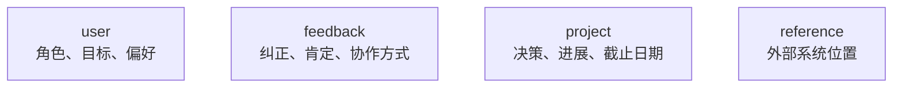
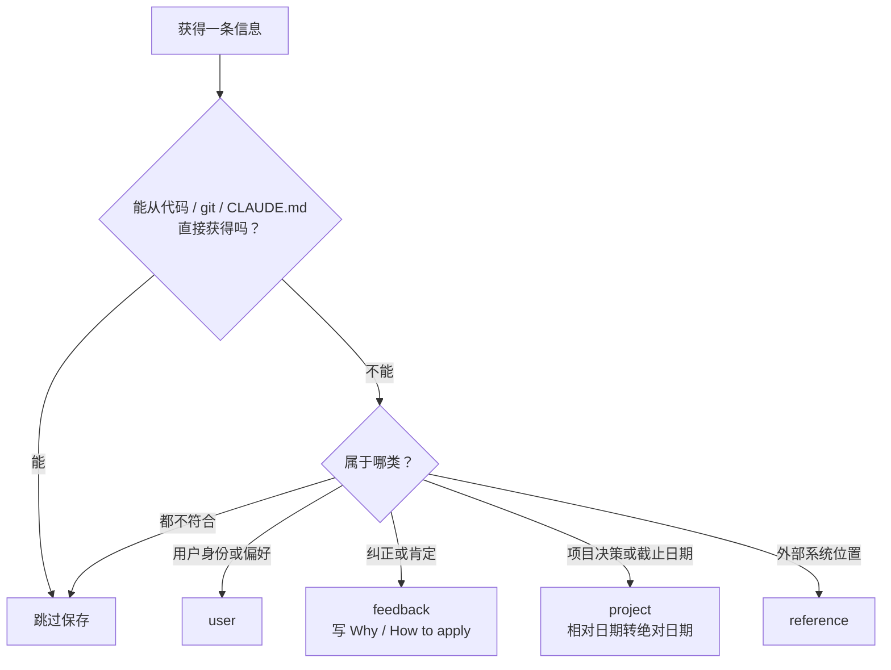
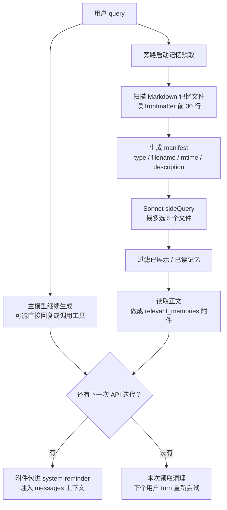
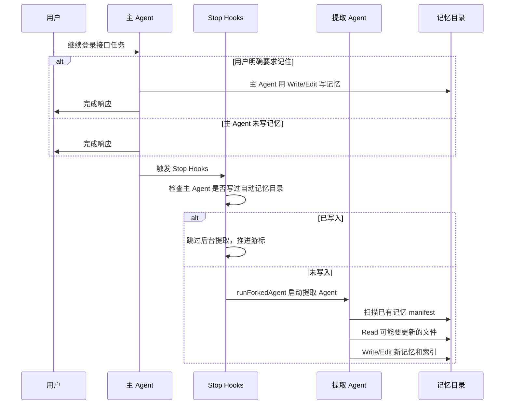
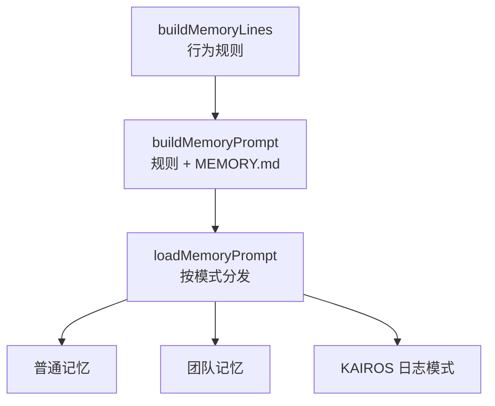

# 第 6 章：记忆系统（简明版）

> **记忆系统让 Claude Code 在跨会话协作中延续用户偏好、项目决策和外部线索，同时提醒模型回到当前代码验证事实。**

> **读完你能知道**：Claude Code 会保存哪些信息、跳过哪些信息；记忆怎样写入、索引、召回和注入上下文；后台提取、团队记忆、子 Agent 记忆各自解决什么问题。

---

## 贯穿全章的例子

继续前几章的 **Spring Boot 登录接口**项目。接口做完后，你和 Claude 又连续协作了三天：

- 第一天，你提醒它：回复保持简洁，末尾别再总结 diff。
- 第二天，团队决定：`2026-03-05` 后进入移动端发布冻结，登录接口只合并紧急修复。
- 第三天，你告诉它：登录线上 Bug 在 Linear 的 `AUTH` 项目里，标签是 `login-v2`。
- 之后，你派了一个安全审查子 Agent 检查登录逻辑。

这些信息有些应该跨会话保存，有些应该在下次任务里从代码、git 或 `CLAUDE.md` 重新确认。记忆系统的主线很简单：**记住协作中难以从当前项目推导的信息，代码事实现场验证。**

| 故事阶段 | 本章机制 |
|---|---|
| 你反复要求短回复 | feedback 记忆 |
| 团队给出发布冻结日期 | project 记忆 |
| 你提供 Linear 入口 | reference 记忆 |
| 下次继续登录模块 | 语义召回 |
| 记忆已经过了几十天 | 新鲜度警告与验证 |
| 回合结束后自动沉淀信息 | 后台提取 Agent |
| 子 Agent 学到审查经验 | Agent 记忆 |

---

## 6.1 为什么 Agent 需要记忆？

**没有记忆，Claude Code 每次会话都要重新学习你的协作习惯。**

登录接口任务里，你已经说过两次“回复别在末尾总结”。这类偏好来自你本人，源码和 git 都无法推导，所以适合进入记忆。相反，登录接口在哪个包、测试怎么跑、当前依赖版本是多少，都能从项目里读取；保存这些内容会在重构后制造旧事实。

记忆系统的核心约束：

> **只保存当前项目状态无法直接推导的信息。**

适合保存的内容：

- 你的表达偏好、工作偏好、长期目标。
- 用户对 Claude 行为的纠正或肯定。
- 项目决策、截止日期和背后的原因。
- 外部系统里信息的位置。

### 记忆 vs CLAUDE.md：各自负责什么

**`CLAUDE.md` 放团队稳定规则，记忆放协作中逐步沉淀的动态信息。**

| 维度 | CLAUDE.md | 记忆系统 |
|---|---|---|
| 维护方式 | 人手动维护，常随项目提交 | Agent 自动写入，用户也可 `/remember` |
| 适合内容 | 测试框架、目录约定、构建命令 | 用户偏好、行为反馈、项目动态、外部入口 |
| 作用范围 | 项目或团队共享 | 默认个人私有，可启用团队记忆 |
| 加载方式 | 会话开始读取 | 索引预加载，详情按需召回 |

登录项目里，`CLAUDE.md` 写“测试用 JUnit 5”，记忆写“用户希望交付回复简洁”。前者是项目规则，后者是协作偏好。

## 6.2 四种记忆类型：封闭分类法

**Claude Code 固定使用四类记忆，避免随手贴标签导致召回混乱。**



| 类型 | 登录项目里的例子 | 触发时机 |
|---|---|---|
| `user` | 用户偏好短回复，熟悉 Spring Boot | 了解到角色、目标、长期偏好 |
| `feedback` | 回复末尾别总结；先补测试再改实现 | 用户纠正或肯定工作方式 |
| `project` | `2026-03-05` 后发布冻结 | 出现项目决策、里程碑、原因 |
| `reference` | Linear `AUTH` 项目，标签 `login-v2` | 出现外部系统入口或查找线索 |

固定四类有两个作用：写入时逼模型判断信息性质；召回时让模型知道该怎样使用这条信息。

### feedback 类型深度分析：同时记录肯定和纠正

**feedback 既记录用户指出的问题，也记录用户认可的做法。**

你说“这次先补测试再改实现的顺序很好”，这值得保存。下次做注册接口或支付接口时，Claude 可以复用这套推进方式。只记录纠正会让模型越来越保守；肯定反馈能稳定复现你认可的方法。

### feedback 和 project 的结构化要求

**关键记忆要写清事实、原因和使用方式。**

```markdown
回复保持简洁，末尾省略已完成操作总结。

**Why:** 用户会自己看 diff，尾部总结会增加阅读噪声。
**How to apply:** 普通交付回复直接说明改动和验证。
```

`Why` 让 Claude 能判断边界。比如“集成测试不要 mock 数据库”的原因是“上次 mock 测试通过但生产迁移失败”，那它下次就知道这条规则主要约束集成层。

### project 类型：相对日期 → 绝对日期

**项目记忆中的日期必须落到具体日历日。**

如果用户说“下周四之后冻结”，记忆要保存成“`2026-03-05` 后冻结”。几周后再读，“下周四”已经失去上下文；绝对日期仍然可判断。

### 什么不该保存

**能从当前项目查到的信息，交给代码、文档和 git。**

登录项目里通常跳过：

- `AuthController` 的路径。
- 登录接口当前实现细节。
- 最近哪个 commit 改了密码校验。
- `pom.xml` 的依赖版本。
- `CLAUDE.md` 已经写明的测试命令。
- 当前会话里的临时 todo。

### 记忆决策流程



## 6.3 存储架构

**每条记忆是一个独立 Markdown 文件，项目有自己的记忆目录。**

### 目录结构

```text
~/.claude/projects/{project-hash}/memory/
├── MEMORY.md
├── feedback_short_reply.md
├── project_mobile_freeze.md
└── reference_linear_auth.md
```

`MEMORY.md` 是索引，其他文件保存具体内容。

### 路径解析：三级优先

**记忆目录优先听显式配置，默认落到项目专属路径。**

| 优先级 | 来源 | 用途 |
|---|---|---|
| 1 | `CLAUDE_COWORK_MEMORY_PATH_OVERRIDE` | SDK / Cowork 等集成场景指定路径 |
| 2 | `autoMemoryDirectory` | 用户在 settings 中自定义 |
| 3 | `~/.claude/projects/{sanitized-git-root}/memory/` | 默认项目记忆目录 |

项目仓库里的 `.claude/settings.json` 不参与记忆目录选择。仓库文件可以由别人提交，安全敏感路径不能交给项目级配置决定。

### 存储格式

**frontmatter 给召回系统看，正文给模型使用。**

```markdown
---
name: 简洁回复偏好
description: 用户希望交付回复简洁，末尾省略 diff 总结
type: feedback
---

回复保持简洁，末尾省略已完成操作总结。

**Why:** 用户会自己看 diff，尾部总结会增加阅读噪声。
**How to apply:** 普通交付回复直接说明改动和验证。
```

`description` 要具体，因为语义召回会先看它判断相关性。“用户偏好”太泛，“用户希望交付回复简洁”更容易命中。

## 6.4 MEMORY.md：索引文件

**`MEMORY.md` 只列记忆清单，让 Claude 在会话开始时知道有哪些记忆可查。**

```markdown
- [简洁回复偏好](feedback_short_reply.md) — 用户希望交付回复简洁
- [移动端发布冻结](project_mobile_freeze.md) — `2026-03-05` 后登录接口只合并紧急修复
- [Linear 登录入口](reference_linear_auth.md) — 登录 Bug 在 Linear AUTH 项目，标签 login-v2
```

它每次会话都会加载进上下文，所以必须紧凑。详细内容放到单独文件里，等语义召回选中后再读，**也是一个渐进式加载的思想**。

### 双层截断机制

**索引太长会被截断，避免挤占上下文。**

| 限制 | 作用 |
|---|---|
| 最多 200 行 | 控制索引条目数量 |
| 最多 25KB | 防止少量超长行撑爆上下文 |

截断后，系统会追加警告，提醒模型把索引条目压到一行，把细节移到主题文件里。

## 6.5 后台记忆召回 Workflow

**用户发起新请求时，系统在旁路启动记忆召回；主模型继续工作，召回赶上后续迭代时再注入上下文。**

你隔了两周回来问“登录接口上线前还有什么要注意？”主模型可能先去读登录接口代码、跑测试；与此同时，系统在后台扫描记忆目录，寻找发布冻结、Linear 入口、你的回复偏好等相关内容。

这条链路有三个容易误解的点：

- **系统侧启动**：主模型不会返回 `RecallMemory` 之类的工具调用。用户 turn 开始后，系统自动启动一次异步预取。
- **旁路模型筛选**：相关性判断由 `sideQuery()` 调用 Sonnet 完成，输入是用户 query、记忆 manifest、最近成功使用的工具。
- **赶上才注入**：如果主模型直接文本回答并结束，本次未完成的预取会被清理；如果主模型调用工具并进入下一次 API 迭代，已完成的记忆会作为附件进入上下文。



这里没有向量数据库，也没有图数据库。存储层是普通 Markdown 文件，候选生成靠文件扫描，语义判断靠 Sonnet 读 manifest。它是一套轻量的“文件型语义召回”。

### scanMemoryFiles()：单次遍历优化

**扫描阶段只读每个文件开头，按修改时间保留最新 200 个。**

frontmatter 都在文件顶部，选择阶段只需要 `description`、`type` 和修改时间。系统只读前 30 行，排序后保留最新 200 个候选。

### formatMemoryManifest()：清单格式

**manifest 把候选记忆压成模型容易判断的一行摘要。**

```text
- [feedback] feedback_short_reply.md (2026-03-01T10:30:00Z): 用户希望交付回复简洁
- [project] project_mobile_freeze.md (2026-03-02T09:00:00Z): `2026-03-05` 后登录接口只合并紧急修复
```

时间戳帮助模型判断新鲜度。

### selectRelevantMemories()：Sonnet 语义评估

**召回用语义选择，避免只靠关键词碰运气。**

用户问“上线前注意事项”时，关键词未必出现“冻结”。Sonnet 能理解发布冻结与上线风险有关，于是选中 `project_mobile_freeze.md`。最多选 5 条，是召回价值和上下文成本之间的平衡。

### recentTools 参数：精确的噪声过滤

**最近已经用过的工具文档会降权，警告和项目线索仍然保留价值。**

如果 Claude 刚调用过 Linear MCP，普通“Linear 怎么用”的记忆价值较低；“Linear AUTH 标签里有登录线上 Bug”仍然相关。

### alreadySurfaced 预过滤

**已经展示过的记忆会提前过滤，避免浪费 5 个召回名额。**

### 异步预取：不阻塞主循环

**记忆召回在后台跑，尽量不增加用户等待。**

主模型开始生成回复的同时，系统用 `sideQuery()` 做记忆选择。等主循环需要附件时，结果通常已经准备好。

如果结果已经准备好，注入形态大致是：

```text
<system-reminder>
Memory (saved today): ~/.claude/projects/.../memory/feedback_short_reply.md:

---
name: 简洁回复偏好
description: 用户希望交付回复简洁
type: feedback
---

回复保持简洁，末尾省略已完成操作总结。
</system-reminder>
```

超过 1 天的记忆会先带一段新鲜度提醒，要求模型在使用代码事实前回到当前项目验证。这个附件进入的是 messages 上下文，不改静态 system prompt，也不改工具定义。

## 6.6 记忆新鲜度与漂移防御

**记忆是写入当时的观察，使用前要考虑时间和当前代码状态。**

登录接口两周后可能已经改过目录、测试方式和发布计划。旧记忆仍有价值，但不能直接当成当前事实。

### 人类可读的时间距离

```text
saved today
saved yesterday
saved 47 days ago
```

“47 days ago”比 ISO 时间更直接，模型更容易意识到需要验证。

### 新鲜度警告

**超过 1 天的记忆会带上提醒，要求核对当前代码。**

如果旧记忆提到“密码校验函数在某个类里”，Claude 应该用 Read、Grep 或 Glob 重新确认。

### 记忆访问三规则

**相关时主动查，用户要求时必须查，用户要求忽略时彻底忽略。**

- 你问“记得我之前说过上线冻结吗？”Claude 必须访问记忆。
- 你问“继续做登录接口”，系统可以按相关性召回。
- 你说“这次忽略发布冻结记忆”，Claude 就把它从决策里拿掉。

### 信任召回：先验证再使用

**记忆提示方向，当前代码提供事实。**

记忆说“登录 Bug 在 Linear `AUTH` 项目”，Claude 可以据此检索。记忆说“密码校验函数在 `AuthService`”，Claude 需要先 Grep 或 Read，确认函数仍然存在。

## 6.7 Stop Hook 驱动的后台记忆构建 Workflow

**记忆构建有两条写入路径：主 Agent 可以直接写，主 Agent 没写时，Stop Hook 再触发后台提取 Agent 补一次。**

你说“以后改登录这种跨层接口，先列接口契约，再补测试”。如果主 Agent 判断这句话需要保存，它可以直接用 `Write` / `Edit` 写入记忆目录；如果主 Agent 只是正常完成回复，回合结束后的 Stop Hooks 会启动一个后台 forked Agent，从最近这段对话里提取值得保存的记忆。

这条链路的关键设计是“补位”：

- **主 Agent 主动写**：用户明确说“记住这个”时，主 Agent 按系统提示词里的记忆规则，直接写 Markdown 记忆文件和 `MEMORY.md` 索引。
- **后台 Agent 自动写**：主 Agent 完成最终回复后，Stop Hooks 触发 `executeExtractMemories()`，fork 一个提取 Agent 分析最近消息。
- **互斥避免重复**：后台 Agent 启动前会检查主 Agent 最近是否已经对自动记忆目录执行过 `Write` / `Edit`。如果写过，后台提取跳过，并推进游标。

### 整体架构



### 主 Agent 怎样写记忆

**主 Agent 通过普通文件工具写记忆，没有单独的 MemoryWrite 工具。**

系统提示词已经告诉主 Agent：记忆目录在哪里、四种类型怎么分、保存时怎样写 frontmatter、普通模式下还要更新 `MEMORY.md`。所以当用户明确说“记住”时，主 Agent 可以直接：

```text
Write ~/.claude/projects/.../memory/feedback_login_contract_first.md
Edit  ~/.claude/projects/.../memory/MEMORY.md
```

这也是后台提取要先检查主 Agent 写入记录的原因。同一段对话已经由主 Agent 保存过，后台再写一次会产生重复主题或重复索引。

### 触发、互斥与重叠防护

**后台构建在 Stop Hooks 阶段触发，同时用游标、互斥和 trailing run 控制冲突。**

控制点有四个：

- **触发点**：主 Agent 产生最终回复、没有更多工具调用后，进入 Stop Hooks。
- **消息游标**：系统记录上次处理到哪条消息，后台提取只看游标之后的新消息。
- **主 Agent 互斥**：检测到最近消息里有指向自动记忆目录的 `Write` / `Edit`，后台提取直接跳过。
- **重叠防护**：上一次提取仍在运行时，新上下文先暂存为 `pendingContext`；当前提取完成后，再用最新上下文跑一次 trailing extraction。

### 工具权限：严格的写入白名单

| 工具 | 权限 |
|---|---|
| Read / Grep / Glob | 可读取已有记忆和必要上下文 |
| Bash | 只允许只读命令 |
| Edit / Write | 仅限自动记忆目录 |
| 其他工具 | 拒绝 |

它的任务是沉淀记忆，不需要改项目代码或调用外部服务。

### 提取提示词设计

**提取 Agent 只从最近对话中沉淀协作信息，通常两轮完成：先读，再写。**

提示词会先把已有记忆 manifest 塞给它，避免它为了查目录浪费回合。它的任务边界很窄：

- 只使用最近约 `N` 条新消息。
- 先检查已有记忆，能更新旧文件就更新旧文件。
- 普通模式下写主题文件后，还要更新 `MEMORY.md` 索引。
- 不读项目源码验证内容，也不跑 git；它负责提取对话里的协作事实。
- 硬上限是 5 个回合，正常情况 2 到 4 个回合结束。

### 共享 Prompt Cache

**后台 forked Agent 继承主会话前缀，复用父会话 prompt cache。**

提取 Agent 通过 `runForkedAgent()` 启动，拿到和主会话一致的系统提示词、用户上下文、系统上下文和消息前缀。稳定前缀可以命中缓存，后台构建的成本更可控。

## 6.8 记忆提示词构建层级

**记忆系统通过提示词告诉模型如何保存、访问、忽略和验证记忆。**



### buildMemoryLines()：行为指令的八个子节

**这一层定义模型对记忆的基本行为。**

八类内容可以压缩成：目录已存在；“记住/忘记”如何处理；四类记忆定义；跳过保存的内容；如何写文件和更新索引；何时访问和忽略；旧记忆要验证；Plan、Task、Memory 各自用途。

登录接口的大改动方案适合 Plan；当前会话进度适合 Task；“用户希望短回复”适合 Memory。

### KAIROS 模式

**KAIROS 面向高频长期会话，先按日期追加日志，再定期整理成结构化记忆。**

```text
~/.claude/projects/{hash}/logs/2026/04/2026-04-01.md
```

它适合长时间、密集互动的助手场景。

## 6.9 团队记忆

**团队记忆让项目决策和外部入口可以被成员共享，个人偏好继续留在私有空间。**

```text
~/.claude/projects/{hash}/memory/
├── MEMORY.md
├── feedback_short_reply.md
└── team/
    ├── MEMORY.md
    ├── project_mobile_freeze.md
    └── reference_linear_auth.md
```

### 作用域指导

| 类型 | 默认作用域 | 登录项目里的判断 |
|---|---|---|
| `user` | 私有 | 你的短回复偏好只影响你 |
| `feedback` | 多数私有，团队约定可共享 | “集成测试必须连真实数据库”可以共享 |
| `project` | 偏团队 | 发布冻结对所有成员有用 |
| `reference` | 偏团队 | Linear `AUTH` 入口对所有成员有用 |

团队记忆有更严格的敏感信息要求：API Key、凭据、私密客户数据都不能写入团队空间。

## 6.10 Agent 记忆

**子 Agent 也有自己的记忆空间，用来保存某类 Agent 的操作经验。**

登录项目里，安全审查子 Agent 可能学到：本项目安全测试在哪；登录接口要重点看密码哈希、错误信息暴露、会话过期；哪些告警属于常见误报。

### 三个作用域

```text
user    ~/.claude/agent-memory/{agentType}/
project .claude/agent-memory/{agentType}/
local   .claude/agent-memory-local/{agentType}/
```

### 为什么与主记忆分离？

**主记忆服务用户协作，Agent 记忆服务某类子 Agent 的工作方式。**

主记忆保存“用户希望回复简洁”“发布冻结日期”。Agent 记忆保存“安全审查 Agent 在这个项目里怎样查测试、怎样看风险”。分开存储能减少污染。

### 记忆注入方式

**Agent 记忆也用 `MEMORY.md` 索引和语义召回，只是提示词会加入 Agent 专属指导。**

## 6.11 记忆注入对话的方式

**记忆通过两条路进入模型视野：索引随会话加载，正文按需注入。**

### MEMORY.md：用户上下文注入

**会话开始时，`MEMORY.md` 像 `CLAUDE.md` 一样进入用户上下文。**

```text
Contents of ~/.claude/projects/.../memory/MEMORY.md
(user's auto-memory, persists across conversations):

- [简洁回复偏好](feedback_short_reply.md) — 用户希望交付回复简洁
- [移动端发布冻结](project_mobile_freeze.md) — `2026-03-05` 后登录接口只合并紧急修复
```

这让 Claude 第一轮就知道有哪些记忆可能存在，但还没有读取全部详情。

### 召回的记忆：用户消息注入

**被选中的记忆正文会作为 meta 用户消息注入，用户界面通常不显示。**

```text
This memory is 47 days old. Verify against current code before asserting as fact.

Memory: ~/.claude/projects/.../project_mobile_freeze.md:

---
name: 移动端发布冻结
description: `2026-03-05` 后登录接口只合并紧急修复
type: project
---

`2026-03-05` 后移动端发布冻结，登录接口只合并紧急修复。
```

这些消息会包在 `<system-reminder>` 中，成为模型可见、UI 低打扰的上下文。

## 6.12 设计洞察

**记忆系统的核心，是在连续性和正确性之间保持平衡。**

回到登录接口项目，最值得记住的有七点：

1. **只记不可推导信息**：用户偏好、项目决策、外部入口值得保存；代码事实回到代码里确认。
2. **四类型分类降低混乱**：user、feedback、project、reference 覆盖主要协作信息。
3. **索引和正文分离**：`MEMORY.md` 保持短小，详情按需召回。
4. **语义召回更贴近真实问题**：“上线注意事项”可以召回“发布冻结”。
5. **新鲜度防止旧事实误导**：旧记忆提供方向，路径、函数、代码行为都要验证。
6. **后台提取适合沉淀协作经验**：Stop Hook 后启动 forked Agent，用最小权限写记忆。
7. **作用域分离减少污染**：个人、团队、子 Agent 各自保存适合自己的信息。

记忆系统的目标很清楚：延续该延续的协作信息，使用事实前回到当前项目验证。

---

> 对比阅读：本章原版（`docs/08-memory-system.md`）包含完整源码入口、常量和提示词细节，适合继续追实现的读者。本简明版保留小节结构和关键数字，重点解释这些设计怎样出现在一次真实协作里。

上一章：[技能系统](../docs/09-skills-system.md) | 下一章：[Hooks 与可扩展性](../docs/06-hooks-extensibility.md)
