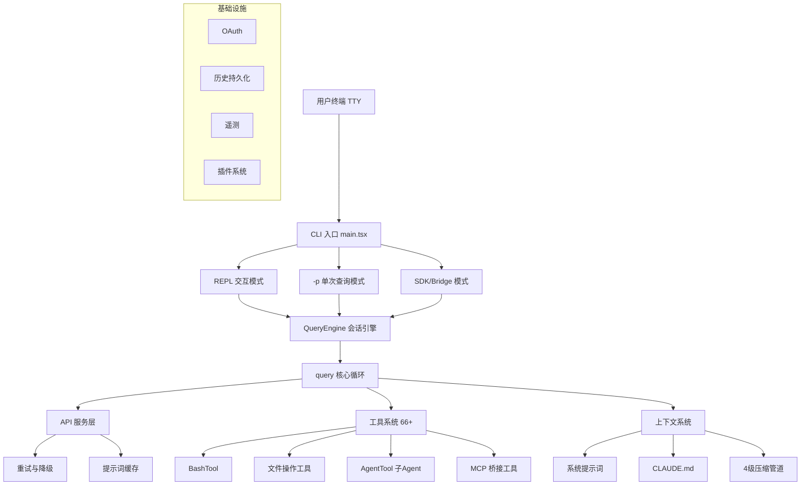

# 第 1 章：Claude Code 概述

## 1.1 Claude Code 解决什么问题

Claude Code 不是一个简单的"CLI 调用大模型"工具。它是 Anthropic 官方推出的 **受控工具循环 Agent（Controlled Tool-Loop Agent）**，专为真实软件工程任务设计。

传统的代码补全工具（如 Copilot）只做单点预测——给你下一行代码。Claude Code 则完全不同：它是一个具备完整工具调用能力、多轮对话记忆、多 Agent 协调能力的自主编程 Agent。它可以：

- **阅读整个代码库**：通过 Grep、Glob、FileRead 等工具理解项目结构
- **精确编辑代码**：通过 search-and-replace 策略以低破坏性方式修改文件
- **执行 Shell 命令**：运行测试、构建、git 操作，并处理输出
- **多 Agent 协作**：派生子 Agent 并行处理复杂任务
- **跨会话记忆**：记住用户偏好和项目上下文

核心设计理念是 **"Agent-first"**：不仅仅辅助编码，而是驱动软件开发的全生命周期——从代码阅读、编写、调试到版本管理、PR 创建。

## 1.2 技术栈

| 层次 | 技术选型 | 说明 |
|------|---------|------|
| 运行时 | Bun | 高性能 JS/TS 运行时，支持编译时 Feature Flag 消除 |
| 语言 | TypeScript | 全量 TypeScript，严格类型检查 |
| UI 框架 | React + Ink（自研） | 基于 React 的终端 UI 框架，自研 Ink 渲染器 |
| 布局引擎 | Yoga | Facebook 的 Flexbox 布局引擎，适配终端 |
| Schema 验证 | Zod | 运行时类型校验，用于配置、工具输入、Hook 输出等 |
| CLI 框架 | Commander.js | 命令行参数解析 |
| API 协议 | Anthropic SDK | 官方 TypeScript SDK，支持流式响应 |

值得注意的是 Bun 的选择——它不仅提供了比 Node.js 更快的启动速度，还通过 `feature()` 宏实现了**编译时死代码消除**。内部功能（如协调器模式、Swarm 团队等）在外部构建中被完全移除，确保发布产物的精简。

## 1.3 核心设计原则

Claude Code 的架构遵循 6 条核心设计原则：

### 1. Generator-based 流式架构

从 API 调用到 UI 渲染，全链路使用 `async function*` 异步生成器。这不是简单的 callback 或 Promise 链——而是真正的流式处理管道，每个 Token、每个工具结果都能实时流向用户界面。

### 2. 防御性分层安全

权限系统采用多层防御：权限规则匹配 → Bash AST 分析（tree-sitter） → 23 项静态安全验证器 → ML 分类器 → 用户确认。任何一层都可以独立阻止危险操作。

### 3. 编译时 Feature Gate

通过 Bun bundler 的 `feature()` 宏实现编译时死代码消除。内部功能（如协调器模式）在外部构建中完全移除——不是运行时隐藏，而是编译时物理删除。

### 4. 状态集中 + 不可变更新

全局状态集中于 `bootstrap/state.ts`（150+ 访问器），UI 状态使用 Zustand 模式的不可变更新。这保证了状态的可追踪性和跨子系统共享的一致性。

### 5. 渐进式压缩

Snip → Microcompact → Context Collapse → Autocompact 四级压缩流水线，确保对话永不因上下文溢出而中断。每级压缩有不同的成本和效果，按需逐级触发。

### 6. 工具即扩展点

所有能力——文件操作、搜索、Agent 派生、MCP 桥接——统一为 `Tool` 接口。第三方可通过 MCP 协议或插件系统无缝扩展，与内置工具享有完全相同的执行管道。

## 1.4 源码目录结构

Claude Code 源码约 1,900 文件、512K+ 行 TypeScript，目录结构如下：

```
src/
├── main.tsx                 # CLI 主入口（4,683 行）
├── QueryEngine.ts           # 会话引擎（1,155 行）
├── query.ts                 # 核心查询循环（1,728 行）
├── Tool.ts                  # 工具接口定义
├── tools.ts                 # 工具注册与组装
├── context.ts               # 上下文构建（190 行）
│
├── bootstrap/               # 全局状态管理
│   └── state.ts             # 集中式状态（1,758 行，150+ getter/setter）
│
├── entrypoints/             # 入口点
│   ├── init.ts              # 核心初始化（341 行）
│   ├── cli.tsx              # 快速路径（--version, MCP server, bridge）
│   └── sdk/                 # SDK 入口与类型
│
├── screens/                 # 主要界面
│   ├── REPL.tsx             # 主对话 UI（895KB）
│   ├── Doctor.tsx           # 诊断界面
│   └── ResumeConversation.tsx
│
├── tools/                   # 66+ 内置工具
│   ├── BashTool/            # Shell 命令执行
│   ├── AgentTool/           # 子 Agent 派生
│   ├── FileReadTool/        # 文件读取
│   ├── FileEditTool/        # 文件编辑（search-and-replace）
│   ├── GrepTool/            # 内容搜索（基于 ripgrep）
│   ├── GlobTool/            # 文件匹配
│   ├── WebFetchTool/        # 网页获取
│   ├── SkillTool/           # 技能调用
│   └── ...                  # 更多工具
│
├── services/
│   ├── api/                 # API 客户端层
│   │   ├── claude.ts        # 核心查询逻辑（3,419 行）
│   │   ├── withRetry.ts     # 重试策略（指数退避+模型降级）
│   │   └── promptCacheBreakDetection.ts  # 缓存断裂检测
│   ├── compact/             # 压缩系统
│   │   ├── autoCompact.ts   # 自动压缩触发
│   │   └── compact.ts       # 摘要生成引擎（1,705 行）
│   ├── mcp/                 # MCP 协议集成（7 种传输）
│   ├── oauth/               # OAuth 2.0 + PKCE
│   ├── plugins/             # 插件系统
│   └── lsp/                 # 语言服务器协议
│
├── hooks/                   # 权限与 Hook 处理
│   └── toolPermission/      # 工具权限判定（3 种处理器）
│
├── coordinator/             # 多 Agent 协调器
├── memdir/                  # 记忆系统
├── skills/                  # 技能系统（18+ 内置技能）
├── ink/                     # 自定义终端渲染器（251KB 核心）
├── vim/                     # Vim 模式
├── schemas/                 # Zod Schema 定义
└── utils/                   # 通用工具库
    ├── hooks.ts             # Hook 执行引擎
    ├── bash/                # Bash AST 解析（tree-sitter）
    └── swarm/               # Swarm 多 Agent 后端
```

## 1.5 架构总览



## 1.6 代码规模参考

| 指标 | 数值 |
|------|------|
| TypeScript 文件 | ~1,332 |
| TSX (React) 文件 | ~552 |
| 总行数 | 512,000+ |
| 内置工具数 | 66+ |
| Hook 事件类型 | 23+ |
| 安全验证器 | 23 项 |
| MCP 传输类型 | 7 种 |
| 权限模式 | 5+2 种 |
| 内置技能 | 18+ |

---

下一章：[系统主循环](./02-agent-loop.md)
