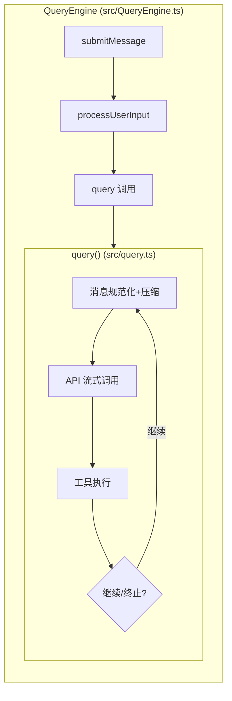
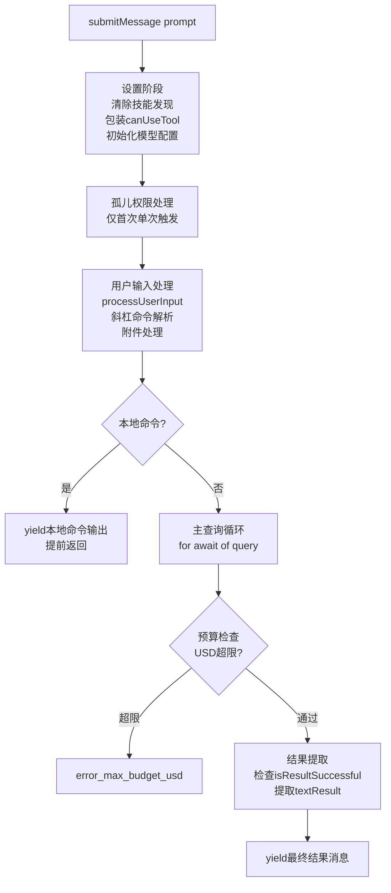
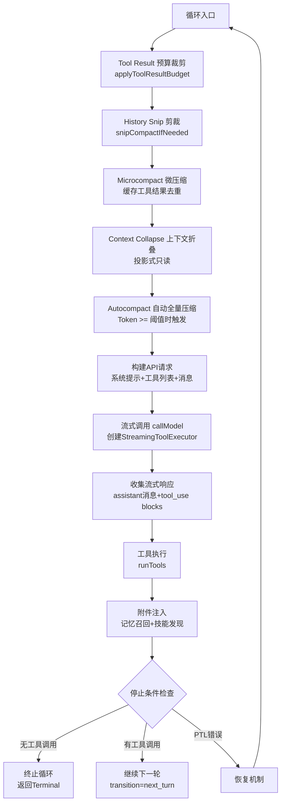
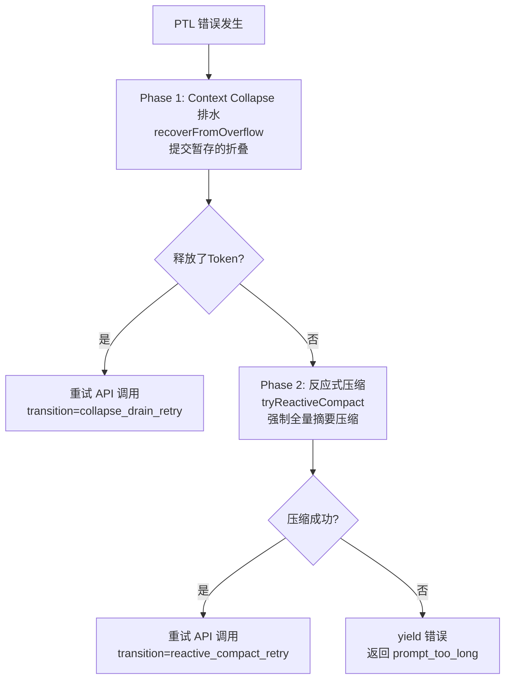
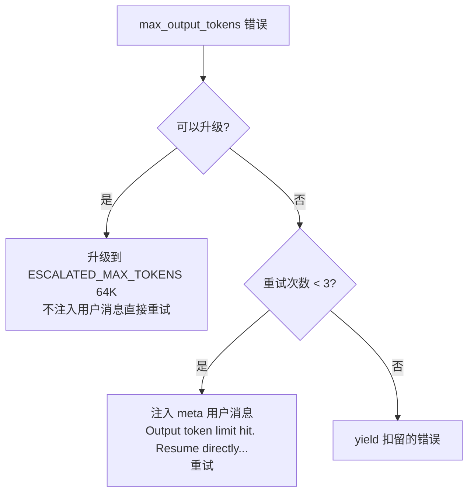

# 第 2 章：系统主循环

> 这是整个 Claude Code 最核心的章节。理解了主循环，就理解了 Claude Code 的灵魂。

## 2.1 全景：一次完整的交互

当用户输入一条消息时，Claude Code 执行以下流程：

```
用户输入 → 上下文组装 → 模型决策 → 工具执行 → 结果注入 → 继续/停止
```

这个循环不断重复，直到模型决定不再调用工具——返回纯文本响应为止。这就是 Agent Loop（代理循环）的本质。

## 2.2 双层生成器架构

Claude Code 的查询系统采用**双层生成器架构**，清晰分离会话管理与查询执行：



| 维度 | QueryEngine | query() |
|------|-------------|---------|
| 作用域 | 对话全生命周期 | 单次查询循环 |
| 状态 | 持久化（mutableMessages, usage） | 循环内（State 对象每次迭代重新赋值） |
| 预算追踪 | USD/轮次检查，结构化输出重试 | Task Budget 跨压缩结转，Token 预算续写 |
| 恢复策略 | 权限拒绝、孤儿权限 | PTL 排水/压缩、max_output_tokens 升级/重试 |

## 2.3 QueryEngine：会话生命周期管理

`src/QueryEngine.ts`（1,155 行）是对话的外壳。它的核心方法 `submitMessage()` 驱动一次完整的用户交互：



关键配置参数（`QueryEngineConfig`）包括：
- `tools`: 可用工具集
- `canUseTool`: 权限判定函数
- `maxTurns`: 最大轮次限制
- `maxBudgetUsd`: USD 预算上限
- `taskBudget`: Token 任务预算
- `fallbackModel`: 降级模型

## 2.4 query()：核心循环的实现

`src/query.ts`（1,728 行）是 Claude Code 最复杂的单个模块，实现了一个**基于状态机的异步生成器循环**。

### 核心签名

```typescript
export async function* query(
  params: QueryParams,
): AsyncGenerator<StreamEvent | Message | ToolUseSummaryMessage, Terminal>
```

关键点：这是一个 `async function*`——异步生成器。它不是一次性返回结果，而是**边执行边 yield 事件**，使调用方可以实时渲染流式输出。

### 循环状态

每次循环迭代共享一个可变的 `State` 对象：

```typescript
type State = {
  messages: Message[]           // 当前消息列表
  toolUseContext: ToolUseContext // 工具执行上下文
  autoCompactTracking: AutoCompactTrackingState | undefined
  maxOutputTokensRecoveryCount: number   // 输出Token恢复计数
  hasAttemptedReactiveCompact: boolean   // 是否已尝试反应式压缩
  maxOutputTokensOverride: number | undefined
  turnCount: number             // 当前轮次
  transition: Continue | undefined  // 上一次循环继续的原因
}
```

### 单次循环迭代流程



## 2.5 流式处理机制

Claude Code 的流式处理不是简单的"等 API 返回再显示"。它利用 `StreamingToolExecutor` 实现了**流式工具并行执行**：

```
                    API 流式输出
                    ▼▼▼▼▼▼▼▼▼▼
    ┌──────────────────────────────────┐
    │ StreamingToolExecutor            │
    │                                  │
    │ tool_use_1 完成 → 立即执行 ────→ │ 结果就绪
    │ ...模型继续生成...                │
    │ tool_use_2 完成 → 立即执行 ────→ │ 结果就绪
    │ ...模型继续生成...                │
    │ tool_use_3 完成 → 立即执行 ────→ │ 结果就绪
    └──────────────────────────────────┘

    时间线对比：
    串行执行：  [===API===][tool1][tool2][tool3]
    流式并行：  [===API===]
                   [tool1]     ← 利用流式窗口 (5-30s)
                      [tool2]  ← 覆盖 ~1s 工具延迟
                         [tool3]
                [==结果即时可用==]
```

在模型生成输出的 5-30 秒流式窗口中，已完成输入的工具调用可以立即开始执行，利用这个窗口覆盖约 1 秒的工具执行延迟。

## 2.6 七个继续点（Continue Sites）

`query()` 循环有 7 个导致循环继续的位置，每个对应一种恢复策略：

| 继续原因 | 触发条件 | 处理方式 |
|---------|---------|---------|
| `next_turn` | 模型调用了工具 | 正常继续，带上工具结果 |
| `collapse_drain_retry` | PTL 错误 + Context Collapse 有暂存 | 提交折叠，释放 Token，重试 |
| `reactive_compact_retry` | PTL 错误 + Collapse 不够 | 强制全量摘要压缩，重试 |
| `max_output_tokens_escalate` | 输出 Token 不够 | 升级到 64K Token 限制 |
| `max_output_tokens_recovery` | 升级不可用/已用 | 注入续写提示，最多重试 3 次 |
| `stop_hook_blocking` | Stop Hook 阻止终止 | 继续执行 |
| `token_budget_continuation` | Token 预算续写 | 继续生成 |

### PTL（Prompt-Too-Long）恢复流程



### Max-Output-Tokens 恢复



## 2.7 错误扣留策略（Withholding）

这是 Claude Code 最巧妙的设计之一：**可恢复的错误不立即 yield 给上层**。

当出现 `prompt_too_long` 或 `max_output_tokens` 错误时，query() 不会立即通知调用方。它将错误推入 `assistantMessages` 但保留引用，然后运行恢复检查。如果恢复成功，错误**永远不会暴露给调用者**（包括 SDK 消费者和桌面应用），用户完全感知不到中间的错误。

```typescript
// 错误扣留检测函数
function isWithheldMaxOutputTokens(msg): msg is AssistantMessage {
  return msg?.type === 'assistant' && msg.apiError === 'max_output_tokens'
}
```

## 2.8 Token 使用追踪

QueryEngine 维护完整的 Token 使用统计：

```typescript
totalUsage: {
  input_tokens: 0,
  output_tokens: 0,
  cache_read_input_tokens: 0,
  cache_creation_input_tokens: 0,
  server_tool_use_input_tokens: 0,
}
```

每条消息的 `message_delta` 事件中更新 `currentMessageUsage`，`message_stop` 时累加到 `totalUsage`。`getTotalCost()` 计算 USD 总成本，用于预算检查——一旦超过 `maxBudgetUsd`，整个查询终止。

## 2.9 停止条件

循环在以下条件下终止：

1. **模型未调用工具**：返回纯文本响应，正常结束
2. **达到最大轮次**：`maxTurns` 限制
3. **USD 预算超限**：`getTotalCost() > maxBudgetUsd`
4. **用户中断**：`abortController.signal` 被触发
5. **不可恢复的错误**：PTL/MOT 恢复全部失败
6. **连续压缩失败**：3 次 autocompact 连续失败（熔断器）

## 2.10 设计亮点总结

1. **双层生成器分离关注点**：QueryEngine 管会话生命周期，query() 管单次循环
2. **流式工具并行执行**：利用 API 流式窗口覆盖工具延迟
3. **错误扣留保证用户无感知恢复**：可恢复错误不暴露给上层
4. **7 个精确的继续点**：每种恢复策略都有明确的 transition 标记，可测试、可追踪
5. **Task Budget 跨压缩结转**：压缩前后的 Token 预算无缝衔接

---

上一章：[概述](./01-overview.md) | 下一章：[上下文工程](./03-context-engineering.md)
