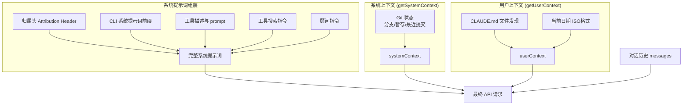
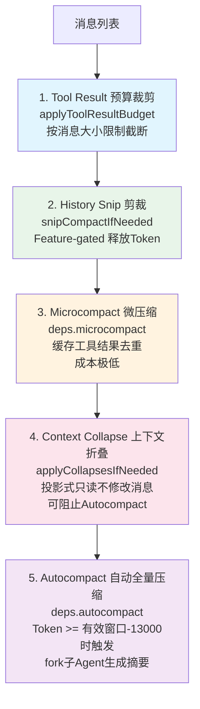
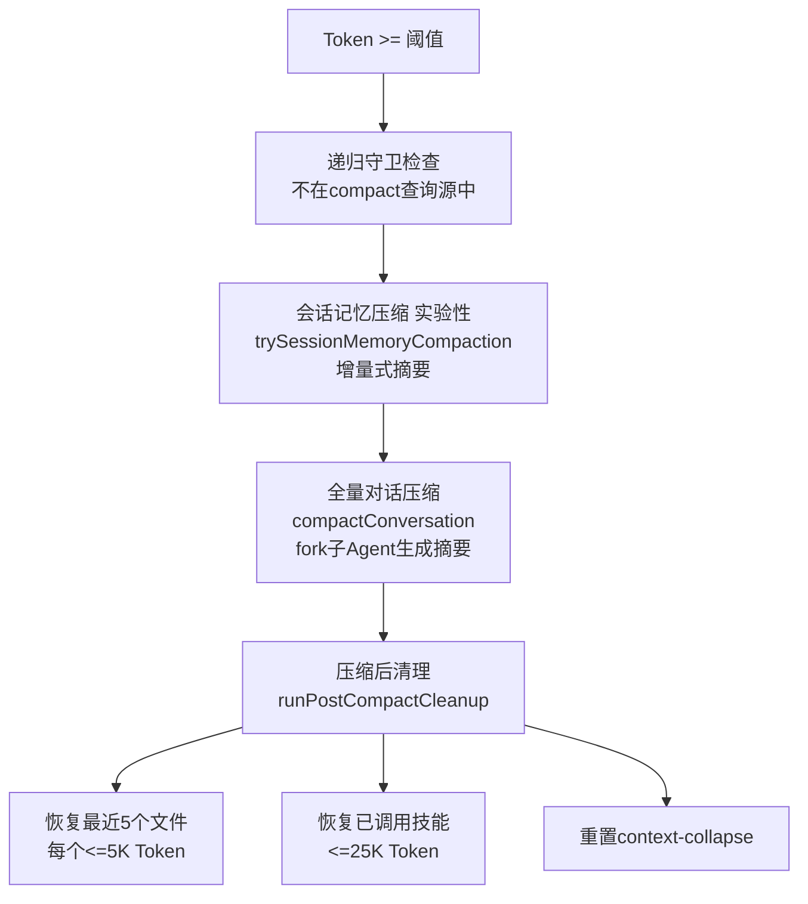
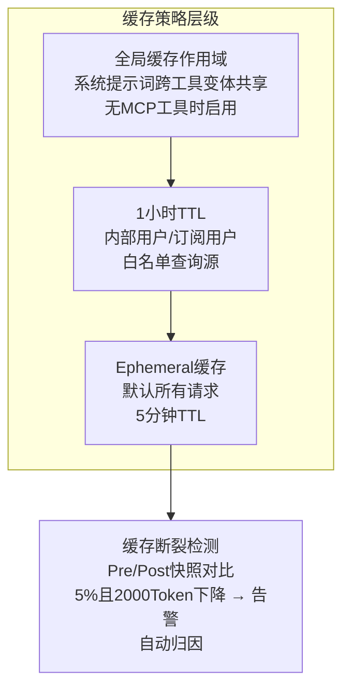

# 第 3 章：上下文工程

> 上下文工程是 Claude Code 能力的隐形支柱。模型的决策质量完全取决于它看到了什么上下文。

## 3.1 上下文构建全景

每次 API 调用前，Claude Code 需要组装完整的上下文。这个过程涉及多个来源、多层处理，最终形成一个精心构造的 prompt。

关键文件：`src/context.ts`（190 行）、`src/utils/api.ts`、`src/services/compact/`



## 3.2 系统提示词的构建

系统提示词由以下部分按序组装：

### 归属头（Attribution Header）
基于指纹的身份标识，用于追踪请求来源。

### CLI 系统提示词前缀
根据运行模式变化：交互式模式（REPL）和 `-p` 单次查询模式有不同的前缀指令。

### 系统上下文（`getSystemContext`）

来自 `src/context.ts` 的 `getSystemContext()` 函数，**被 memoize 缓存**（每会话只计算一次）：

```typescript
export const getSystemContext = memoize(async () => {
  // 跳过条件：CCR 远程模式 或 禁用 git-instructions
  const gitStatus = await getGitStatus()
  return {
    ...(gitStatus && { gitStatus }),
  }
})
```

Git 状态信息包括：
- 当前分支
- 默认分支（用于 PR）
- Git 用户名
- `git status --short`（截断至 2000 字符）
- 最近 5 次提交日志

### 用户上下文（`getUserContext`）

```typescript
export const getUserContext = memoize(async () => {
  const claudeMd = getClaudeMds(filterInjectedMemoryFiles(await getMemoryFiles()))
  return {
    ...(claudeMd && { claudeMd }),
    currentDate: `Today's date is ${getLocalISODate()}.`,
  }
})
```

核心是 **CLAUDE.md 机制**——项目级指令文件：
- 文件名模式：`.claude*`（包括 `CLAUDE.md`、`.claude/instructions.md` 等）
- 发现范围：从 CWD 向上遍历目录树
- 注入方式：作为用户上下文的一部分
- 可通过 `CLAUDE_CODE_DISABLE_CLAUDE_MDS=true` 或 `--bare` 模式禁用

### 上下文注入顺序

```typescript
// src/utils/api.ts
const fullSystemPrompt = asSystemPrompt(
  appendSystemContext(systemPrompt, systemContext)  // 系统上下文后置
)
// userContext 在消息前置（prependUserContext）
```

系统上下文**后置**于系统提示词，用户上下文**前置**于消息——这个顺序影响提示词缓存的效率。

## 3.3 消息历史管理

Claude Code 不是简单地将所有历史消息发送给 API。它通过一系列机制管理消息列表：

### 压缩边界（Compact Boundary）
当 autocompact 发生后，只发送压缩边界之后的消息：

```typescript
getMessagesAfterCompactBoundary(messages)
```

这确保压缩后的旧消息不会重复发送。

### 消息规范化（`normalizeMessagesForAPI`）
在发送前，消息经过规范化处理：
- 工具引用（`tool_reference`）剥离
- 顾问块移除
- 媒体项裁剪
- 思考签名块处理

## 3.4 四级压缩流水线

这是 Claude Code 上下文管理的核心机制。当对话越来越长，Token 使用量不断增长，四级压缩流水线逐级启动：



### 为什么按此顺序执行？

1. **Snip 最先**：释放 Token 最多，可能使后续压缩不必要
2. **Microcompact 成本极低**：利用缓存去重，适合频繁执行
3. **Context Collapse 在 Autocompact 之前**：折叠可能阻止不必要的全量压缩
4. **Autocompact 作为最后手段**：全量摘要成本最高

### 各级压缩详解

#### Level 1: Tool Result 预算裁剪

`applyToolResultBudget()` 对单条消息中的工具结果按大小限制截断。这是最轻量的处理——不调用 API，纯本地裁剪。

#### Level 2: History Snip

`snipCompactIfNeeded()` 是 Feature-gated 功能（`HISTORY_SNIP`），通过剪裁历史消息中的冗余部分释放 Token。释放量通过 `snipTokensFreed` 传递给后续的 autocompact 阈值检查。

#### Level 3: Microcompact

缓存级别的工具结果去重。当多次调用同一文件的读取时，去除重复内容。成本极低，每次循环迭代都执行。支持 `CACHED_MICROCOMPACT` Feature Flag 的缓存编辑模式。

#### Level 4: Context Collapse

**投影式**上下文折叠——关键特性是它**不修改原始消息**。它创建消息的折叠视图，将不重要的早期消息替换为摘要。这使得折叠可以跨轮次持久化，且可以在需要时回退。

```typescript
if (feature('CONTEXT_COLLAPSE') && contextCollapse) {
  const collapseResult = await contextCollapse.applyCollapsesIfNeeded(
    messagesForQuery, toolUseContext, querySource
  )
  messagesForQuery = collapseResult.messages
}
```

#### Level 5: Autocompact

触发条件：
```
有效窗口 = context_window(model) - 20,000 (输出预留)
Autocompact 阈值 = 有效窗口 - 13,000
（约 87% 利用率触发摘要）
```

工作流程：



**压缩后恢复机制**：Autocompact 可能让模型"忘记"刚编辑的文件。系统会在压缩后自动执行 `runPostCompactCleanup()`：

1. **恢复最近 5 个文件**：每个文件限 5K Token，确保模型记得刚操作的文件
2. **恢复所有已激活的技能**：预算 25K Token，确保已加载的 [技能](./11-memory-skills.md) 不丢失
3. **重置 Context Collapse**：清除折叠状态，为下一轮压缩准备

这个恢复机制是 Claude Code 能在超长对话中保持连贯性的关键。

**熔断器机制**：连续 3 次 autocompact 失败（`MAX_CONSECUTIVE_AUTOCOMPACT_FAILURES`），停止重试。

## 3.5 Token 预算管理

Claude Code 维护精细的 Token 预算追踪：

### 输出 Token 预留（按模型）

| 模型 | 默认 max_output_tokens |
|------|----------------------|
| Sonnet | 16,000 |
| Haiku | 4,096 |
| Opus | 4,096 |

可通过 `CLAUDE_CODE_MAX_OUTPUT_TOKENS` 环境变量覆盖。

### Token 估算

`tokenCountWithEstimation()` 在本地估算当前 Token 使用量——不调用 API，避免网络延迟。它综合消息 Token 计数、系统提示词大小估算和工具 Schema 开销估算。

### Task Budget 跨压缩结转

每次压缩前捕获 `finalContextTokensFromLastResponse()`，压缩后从剩余量中扣除。这确保跨压缩的 Token 预算连续性——模型不会因为压缩而"丢失"已用预算的记录。

### 关键常量

| 常量 | 值 | 用途 |
|------|-----|------|
| AUTOCOMPACT_BUFFER_TOKENS | 13,000 | 触发阈值缓冲 |
| WARNING_THRESHOLD_BUFFER_TOKENS | 20,000 | UI 警告阈值 |
| ERROR_THRESHOLD_BUFFER_TOKENS | 20,000 | 阻塞限制阈值 |
| MANUAL_COMPACT_BUFFER_TOKENS | 3,000 | 手动压缩缓冲 |
| MAX_CONSECUTIVE_AUTOCOMPACT_FAILURES | 3 | 熔断器阈值 |

## 3.6 提示词缓存策略

Claude Code 实现了多层级的提示词缓存：



缓存断裂检测（`promptCacheBreakDetection.ts`）在每次 API 调用前后记录快照，检测缓存读取 Token 的异常下降，并自动归因到 TTL 过期、客户端变更或服务端变更。

## 3.7 记忆预取

`pendingMemoryPrefetch` 在 query 循环入口处启动，利用 `startRelevantMemoryPrefetch()` 在模型流式生成的同时预取相关记忆。每轮仅消费一次，通过 `settledAt` 守卫防止重复消费，`readFileState` 去重防止重复注入。

## 3.8 设计洞察

1. **Memoize 保证幂等性**：`getSystemContext` 和 `getUserContext` 都是 memoized 的，每会话只计算一次
2. **压缩流水线的渐进性**：从零成本裁剪到全量摘要，按需逐级升级
3. **投影式折叠的可逆性**：Context Collapse 不修改原始消息，可以安全回退
4. **缓存感知的上下文组装**：上下文的注入顺序考虑了提示词缓存的效率

---

上一章：[系统主循环](./02-agent-loop.md) | 下一章：[工具系统](./04-tool-system.md)
