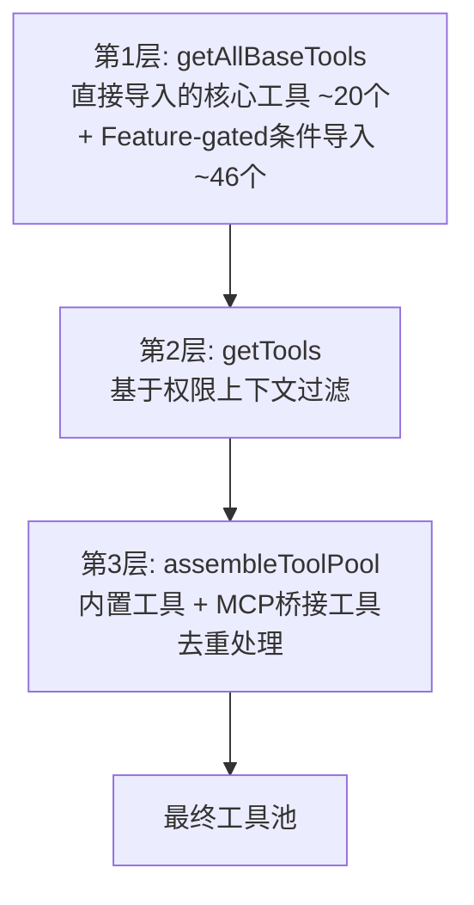
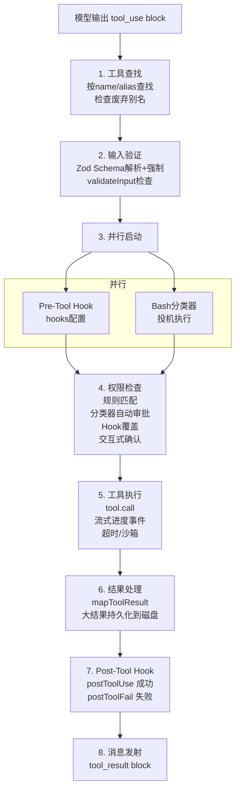

# 第 4 章：工具系统

> 工具系统是 Claude Code 能力的载体。66+ 内置工具 + MCP 扩展 = 无限可能。

## 4.1 Tool 接口定义

Claude Code 的所有能力——文件操作、命令执行、Agent 派生、MCP 调用——都统一抽象为 `Tool` 接口（`src/Tool.ts`）。这是整个系统最核心的类型之一：

```typescript
export type Tool<Input, Output, P extends ToolProgressData> = {
  // ===== 元数据 =====
  name: string                    // 工具唯一标识
  aliases?: string[]              // 别名（兼容旧名称）
  maxResultSizeChars: number      // 结果最大字符数
  shouldDefer?: boolean           // 是否延迟加载（ToolSearch 动态发现）

  // ===== 核心执行 =====
  call(args, context, canUseTool, parentMessage, onProgress?): Promise<ToolResult<Output>>

  // ===== 提示词与描述 =====
  description(input, options): Promise<string>
  prompt(options): Promise<string>

  // ===== Schema 定义 =====
  inputSchema: Input              // Zod 输入 Schema
  inputJSONSchema?: ToolInputJSONSchema  // JSON Schema（API 兼容）

  // ===== 安全与权限 =====
  isConcurrencySafe(input): boolean   // 是否可并发执行
  isReadOnly(input): boolean          // 是否只读操作
  isDestructive?(input): boolean      // 是否破坏性操作
  validateInput?(input, context): Promise<ValidationResult>
  checkPermissions(input, context): Promise<PermissionResult>

  // ===== UI 渲染（React 组件）=====
  renderToolUseMessage(input, options): React.ReactNode
  renderToolResultMessage?(content, progress, options): React.ReactNode
}
```

每个工具返回的 `ToolResult` 不仅包含数据，还可以注入额外消息或修改上下文：

```typescript
export type ToolResult<T> = {
  data: T                    // 工具输出数据
  newMessages?: Message[]    // 额外注入的消息
  contextModifier?: (ctx) => ToolUseContext  // 上下文修改器
}
```

## 4.2 工具注册与组装

`src/tools.ts` 定义了工具的组装流水线：



Feature-gated 工具通过条件 `require()` 加载，在编译时通过 `feature()` 宏决定是否包含：

```typescript
const SleepTool = feature('PROACTIVE') || feature('KAIROS')
  ? require('./tools/SleepTool/SleepTool.js').SleepTool
  : null

const SnipTool = feature('HISTORY_SNIP')
  ? require('./tools/SnipTool/SnipTool.js').SnipTool
  : null
```

## 4.3 内置工具清单

Claude Code 包含 **66+ 内置工具**，按功能分类如下：

| 类别 | 工具 | 说明 |
|------|------|------|
| **文件操作** | BashTool | Shell 命令执行（最复杂的工具） |
| | FileReadTool | 读取文件内容（支持图片、PDF、Jupyter） |
| | FileEditTool | 精确字符串替换编辑（核心编辑工具） |
| | FileWriteTool | 创建/覆盖文件 |
| | GlobTool | 按模式匹配文件 |
| | GrepTool | 正则搜索文件内容（基于 ripgrep） |
| | NotebookEditTool | Jupyter Notebook 编辑 |
| **网络** | WebFetchTool | 获取网页内容 |
| | WebSearchTool | API 驱动的网络搜索 |
| **Agent 管理** | AgentTool | 派生子 Agent（多 Agent 架构核心） |
| | TaskOutputTool | 输出任务结果 |
| | TaskStopTool | 停止后台任务 |
| | TaskCreate/Get/Update/ListTool | 任务管理 v2 |
| | SendMessageTool | Agent 间通信 |
| **用户交互** | AskUserQuestionTool | 向用户提问 |
| | TodoWriteTool | 管理待办列表 |
| | SkillTool | 加载并执行技能 |
| **系统** | EnterPlanModeTool | 进入规划模式 |
| | ExitPlanModeTool | 退出规划模式 |
| | EnterWorktreeTool | 进入 Git Worktree 隔离 |
| | ExitWorktreeTool | 退出 Worktree |
| | BriefTool | 生成简要摘要 |
| | ToolSearchTool | 搜索并加载延迟工具 |
| | ConfigTool | 配置管理 |
| **MCP 集成** | ListMcpResourcesTool | 列出 MCP 资源 |
| | ReadMcpResourceTool | 读取 MCP 资源 |
| | MCPTool | MCP 工具代理 |
| | LSPTool | 语言服务器操作 |
| **团队协作** | TeamCreateTool | 创建 Agent 团队 |
| | TeamDeleteTool | 删除 Agent 团队 |
| | ListPeersTool | 列出同级 Agent |

## 4.4 工具执行生命周期



## 4.5 并发控制

工具的并发执行遵循严格的规则：

- **只读工具可并行**：`isReadOnly(input) === true` 的工具（如 FileReadTool、GrepTool、GlobTool）可以同时执行
- **写入工具串行**：`isReadOnly(input) === false` 的工具（如 FileEditTool、BashTool 写命令）必须串行执行
- **并发安全标记**：`isConcurrencySafe(input)` 提供更细粒度的控制

工具编排由 `src/services/tools/toolOrchestration.ts` 的 `runTools()` 函数管理：

```typescript
// 简化的并发逻辑
const readOnlyTools = toolUses.filter(t => findTool(t).isReadOnly(t.input))
const statefulTools = toolUses.filter(t => !findTool(t).isReadOnly(t.input))

// 只读工具并行执行
await Promise.all(readOnlyTools.map(t => executeTool(t)))

// 有状态工具串行执行
for (const tool of statefulTools) {
  await executeTool(tool)
}
```

## 4.6 BashTool 深度解析

BashTool 是最复杂的内置工具。它的输入 Schema：

```typescript
{
  command: string              // Shell 命令
  timeout?: number             // 超时（毫秒）
  description?: string         // 活动描述（UI 展示）
  run_in_background?: boolean  // 异步执行
  dangerouslyDisableSandbox?: boolean  // 禁用沙箱
}
```

执行流程：
1. 输入验证 → 路径约束检查 → sed 验证
2. 权限检查（7 层安全验证，详见[权限与安全](./06-permission-security.md)）
3. 沙箱模式检测
4. 命令执行（`ExecResult` from `utils/Shell.js`）
5. stdout/stderr 捕获与处理
6. 大结果持久化到 `~/claude-code/tool-results/`
7. 后台任务管理（长命令自动后台化，阈值 15 秒）

BashTool 还内置了命令分类（用于 UI 展示）：

| 类别 | 命令 |
|------|------|
| 搜索 | find, grep, rg, ag, ack, locate, which, whereis |
| 读取 | cat, head, tail, less, more, wc, stat, file, jq, awk |
| 列表 | ls, tree, du |
| 中性 | echo, printf, true, false |

## 4.7 AgentTool 深度解析

AgentTool 负责派生子 Agent，是多 Agent 架构的核心：

```typescript
{
  description: string          // 3-5 词任务描述
  prompt: string               // 子 Agent 任务指令
  subagent_type?: string       // 专用 Agent 类型
  model?: 'sonnet' | 'opus' | 'haiku'
  run_in_background?: boolean  // 异步执行
  name?: string                // 可寻址的队友名称
  isolation?: 'worktree' | 'remote'  // 隔离模式
}
```

子 Agent 的执行模式：
- **同步**：直接在进程内执行，结果嵌入父对话
- **异步**：`LocalAgentTask`，通过文件轮询获取结果
- **队友**：通过 Tmux/iTerm2 会话创建并行工作的 Agent
- **远程**：通过 `RemoteAgentTask` 在 CCR 环境中执行

## 4.8 大结果处理机制

当工具输出超过 `maxResultSizeChars`（通常 100K-500K 字符），Claude Code 不会将全部内容注入对话上下文：

1. 将完整结果保存到 `~/claude-code/tool-results/` 目录
2. 模型接收：文件路径预览 + 截断指示符
3. 模型可通过 FileReadTool 按需读取完整内容

这避免了上下文膨胀，同时保持完整数据的可达性。

## 4.9 MCP 工具集成

MCP（Model Context Protocol）工具通过桥接层无缝集成到 Claude Code 的工具系统中：

| Claude Code 工具 | MCP 功能 |
|-----------------|---------|
| MCPTool | 调用单个 MCP 工具 |
| ListMcpResourcesTool | 列出 MCP 资源 |
| ReadMcpResourceTool | 读取 MCP 资源内容 |

MCP 服务端支持 7 种传输机制：stdio、SSE、HTTP、WebSocket、SDK 原生、IDE SSE、Claude.ai 代理。

配置示例：

```json
{
  "mcpServers": {
    "my-server": {
      "command": "node",
      "args": ["my-mcp-server.js"]
    },
    "remote-server": {
      "url": "https://api.example.com/mcp"
    }
  }
}
```

MCP 工具在 `assembleToolPool()` 阶段与内置工具合并，经过去重处理后统一注册。

## 4.10 工具搜索与延迟加载

并非所有 66+ 工具都会在每次 API 调用时发送给模型。`ToolSearchTool` 支持**延迟加载**：

- `shouldDefer: true` 的工具不会在初始工具列表中出现
- 模型可以调用 `ToolSearch` 搜索并动态加载需要的工具
- 工具的 `searchHint` 字段提供搜索提示

这减少了系统提示词的大小，提高了提示词缓存命中率。

## 4.11 设计洞察

1. **统一接口的力量**：所有工具共享同一个 `Tool` 接口，MCP 工具和内置工具享有完全相同的执行管道
2. **安全即类型**：`isReadOnly`、`isDestructive`、`isConcurrencySafe` 等方法将安全语义编码为类型系统的一部分
3. **渲染即工具**：每个工具自带 React 渲染方法（`renderToolUseMessage` 等），确保 UI 展示与工具逻辑紧密耦合
4. **Feature Gate 实现精确裁剪**：通过编译时 Feature Flag，外部构建只包含公开工具

---

上一章：[上下文工程](./03-context-engineering.md) | 下一章：[代码编辑策略](./05-code-editing-strategy.md)
