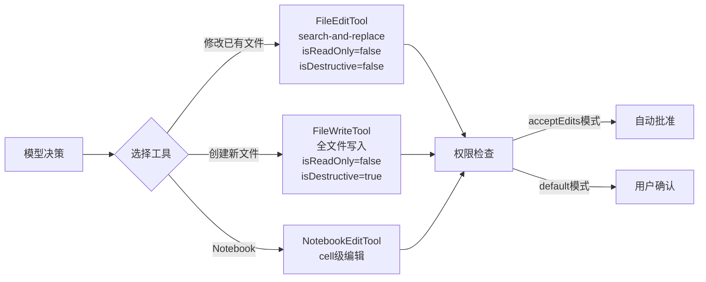

# 第 5 章：代码编辑策略

> 好用的 coding agent 不只是会写代码，而是会用低破坏性的方式改代码。

## 5.1 两种编辑工具

Claude Code 提供两种文件编辑工具，各有其适用场景：

| 工具 | 策略 | 适用场景 | 破坏性 |
|------|------|---------|--------|
| **FileEditTool** | search-and-replace | 修改已有文件中的特定部分 | 低 |
| **FileWriteTool** | 全文件覆盖写入 | 创建新文件或完整重写 | 高 |

系统提示词明确指引模型：**优先使用 FileEditTool**。只有在创建全新文件或需要完整重写时，才使用 FileWriteTool。

## 5.2 FileEditTool：Search-and-Replace 方法

FileEditTool 是 Claude Code 代码编辑的核心工具，采用精确字符串替换策略。

### 输入 Schema

```typescript
{
  file_path: string    // 要编辑的文件绝对路径
  old_string: string   // 要替换的精确字符串
  new_string: string   // 替换后的新字符串
  replace_all?: boolean // 是否替换所有出现位置（默认 false）
}
```

### 工作原理

FileEditTool 不需要行号、不需要正则表达式。它的工作方式极其简单：

1. 在文件中精确查找 `old_string`
2. 确保 `old_string` 在文件中**唯一出现**（除非 `replace_all=true`）
3. 将其替换为 `new_string`
4. 如果 `old_string` 不唯一，返回错误，要求提供更多上下文

### 为什么 Search-and-Replace 优于其他方案

这个设计选择背后有深刻的工程考量：

#### 1. 低破坏性

Search-and-replace 只修改目标文本，文件的其余部分完全不变。相比之下，全文件写入可能：
- 意外丢失未预期的内容
- 引入格式变化（缩进、空行）
- 在大文件上因 Token 限制截断内容

#### 2. 可验证性

每次编辑都有明确的"before"和"after"。用户可以精确看到什么被改了——这比看一个完整的新文件要容易得多。

#### 3. 抗幻觉

模型需要提供文件中**实际存在**的精确字符串。如果模型"幻觉"了不存在的代码，编辑会直接失败并返回错误，而不是静默地写入错误内容。

#### 4. Token 效率

对大文件的小修改，search-and-replace 只需要发送修改点附近的上下文，而不是整个文件内容。

#### 5. Git 友好

Search-and-replace 产生的 diff 最小化、最精确。自动化 PR 创建时，reviewer 看到的是干净的、有针对性的变更。

### 唯一性约束

FileEditTool 要求 `old_string` 在文件中唯一出现。如果不唯一，编辑失败并提示：

```
The edit will FAIL if old_string is not unique in the file.
Either provide a larger string with more surrounding context
to make it unique or use replace_all to change every instance.
```

这个约束是刻意的：

- **防止歧义**：确保模型明确知道它在修改哪段代码
- **要求理解上下文**：模型必须提供足够的上下文来唯一定位修改点
- **`replace_all` 作为逃逸阀**：当需要重命名变量等批量操作时，显式使用 `replace_all: true`

## 5.3 FileWriteTool：全文件写入

FileWriteTool 的定位是创建新文件或完整重写：

```typescript
{
  file_path: string    // 文件绝对路径
  content: string      // 完整文件内容
}
```

系统提示词中的使用指引：
- 对已有文件，**必须先用 Read 工具读取内容**，然后编辑
- 优先使用 Edit 工具修改现有文件——它只发送 diff
- 只在创建新文件或完整重写时使用 Write
- **永远不要创建文档文件**（.md/README），除非用户明确要求
- 避免使用 emoji，除非用户要求

## 5.4 多文件编辑协调

当需要跨多个文件进行协调修改时（如重命名一个被广泛引用的函数），Claude Code 的策略是：

### 串行编辑

由于 FileEditTool 的 `isReadOnly()` 返回 `false`，多个文件编辑操作会**串行执行**。这确保：
- 不会出现竞争条件
- 每个编辑基于文件的最新状态
- 如果中间某个编辑失败，后续编辑不会在错误基础上继续

### 原子性考量

单个 FileEditTool 调用是原子的——要么成功替换，要么完全不修改。但跨多个文件的编辑序列不是原子的。如果中间失败，已完成的编辑不会回滚。

这是一个有意的设计权衡：
- 回滚机制会增加极大的复杂度
- Git 提供了天然的回滚能力（`git checkout`）
- 模型可以在失败后自主修复

### Worktree 隔离

对于大规模重构，AgentTool 支持 Git Worktree 隔离模式。子 Agent 在独立的 Worktree 中工作，完成后由用户决定是否合并：

```typescript
{
  prompt: "重构所有 API 处理函数...",
  isolation: 'worktree'  // 在独立 Worktree 中工作
}
```

## 5.5 编辑前的读取要求

系统提示词强制要求：**编辑文件前必须先读取**。

```
You MUST use your Read tool at least once in the conversation
before editing. This tool will error if you attempt an edit
without reading the file.
```

这不仅是提示词层面的约束——FileEditTool 的实现中实际检查 `readFileState` 缓存，如果文件未被读取过，会返回错误。

这个设计确保模型：
1. 了解文件的当前状态
2. 不会基于过时的记忆进行编辑
3. 能提供正确的 `old_string`

## 5.6 缩进保持

系统提示词中有关于缩进的明确指引：

```
When editing text from Read tool output, ensure you preserve
the exact indentation (tabs/spaces) as it appears AFTER the
line number prefix.
```

这特别重要，因为 Read 工具的输出带有行号前缀（`cat -n` 格式），模型需要正确区分行号前缀和实际文件内容中的缩进。

## 5.7 NotebookEditTool：Jupyter 编辑

对于 Jupyter Notebook，Claude Code 提供专门的 NotebookEditTool。它理解 Notebook 的 cell 结构，支持：
- 编辑特定 cell 的内容
- 插入新 cell
- 删除 cell
- 修改 cell 类型（code/markdown）

## 5.8 与工具系统的整合

编辑工具在工具系统中的位置：



在 `acceptEdits` 权限模式下，编辑类工具自动批准，无需用户确认——这对信任度高的项目是极大的效率提升。

## 5.9 关键设计洞察

1. **低破坏性是核心原则**：search-and-replace 不是因为简单才被选择，而是因为它对代码库的影响最小
2. **失败比静默错误更好**：唯一性约束确保模型不会在歧义场景下做出错误编辑
3. **读取前置是安全网**：强制读取确保模型基于最新状态做编辑
4. **`replace_all` 的克制使用**：默认 `false`，只在明确的批量操作场景下启用
5. **Git 是终极回滚机制**：不需要在编辑工具层面实现复杂的事务或回滚

这个编辑策略的精髓可以用一句话概括：**宁可编辑失败让模型重试，也不要静默地写入错误内容**。

---

上一章：[工具系统](./04-tool-system.md) | 下一章：[权限与安全](./06-permission-security.md)
