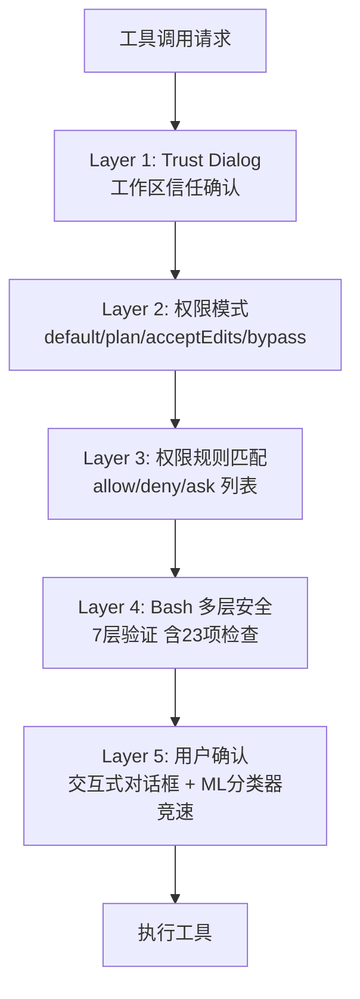
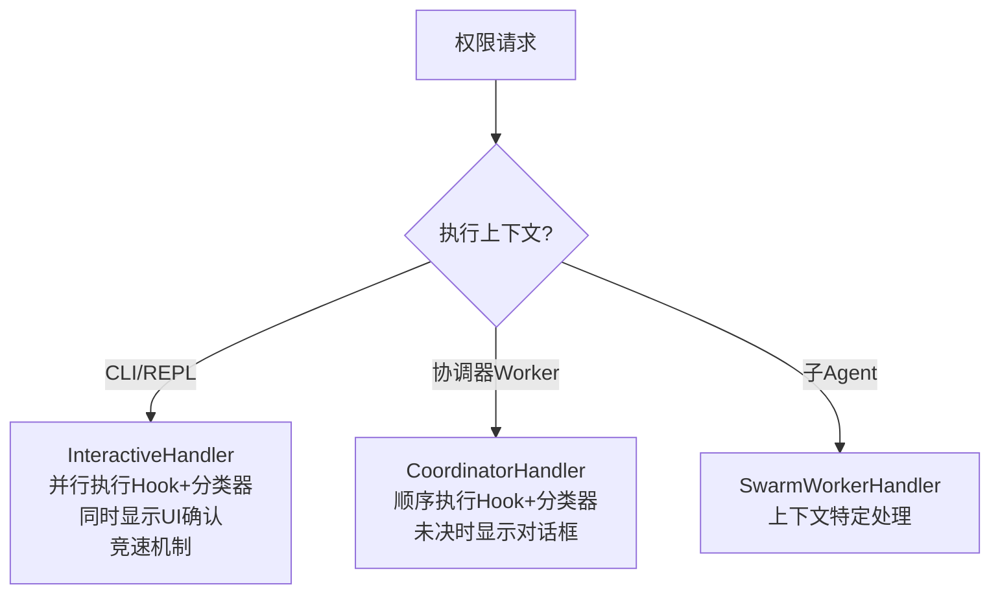
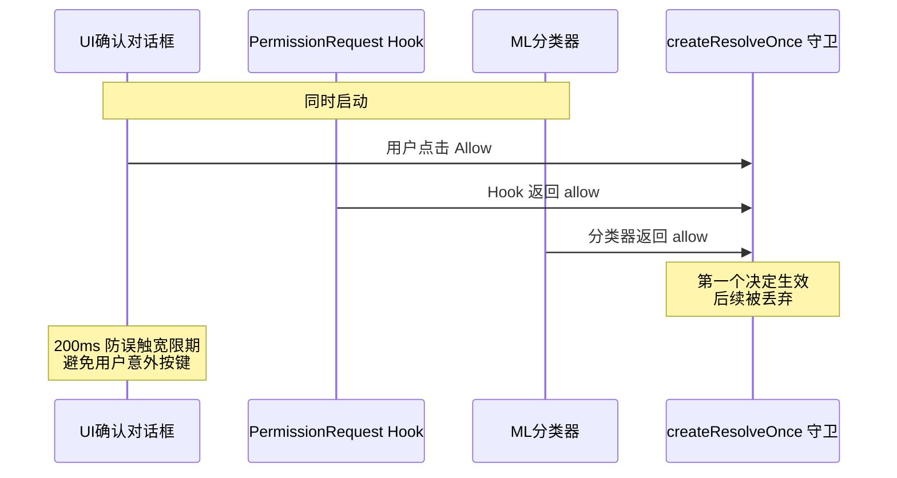
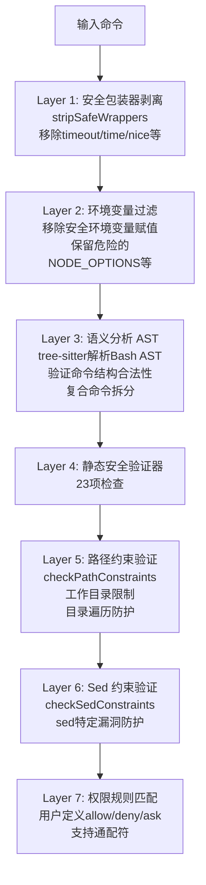
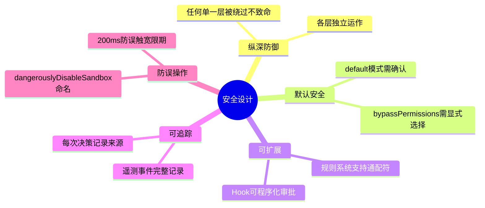

# 第 6 章：权限与安全

> Claude Code 在用户的真实环境中执行代码——安全不是可选的附加功能，而是架构的基石。

## 6.1 纵深防御架构

Claude Code 采用**纵深防御（Defense in Depth）**策略。多个独立的安全层共同保护用户环境——即使某一层被绕过，其他层仍然有效。



## 6.2 权限模式

Claude Code 定义了 5 种外部权限模式和 2 种内部模式：

| 模式 | 行为 | 适用场景 |
|------|------|---------|
| `default` | 无匹配规则时交互确认 | 日常使用 |
| `acceptEdits` | 自动批准 Edit/Write/NotebookEdit | 信任度高的项目 |
| `plan` | 执行前暂停审查 | 敏感操作审计 |
| `bypassPermissions` | 全部自动批准 | 完全信任（危险） |
| `dontAsk` | 类似 bypass 但保留 deny 规则 | CI/CD 环境 |
| `auto`（内部） | ML 分类器自动决策 | 内部使用 |
| `bubble`（内部） | 协调器专用模式 | 多 Agent 协调 |

## 6.3 三种权限处理器

不同执行上下文使用不同的权限处理器：



### InteractiveHandler 的竞速机制

这是最精巧的设计——用户确认和自动化检查**同时进行**：



关键细节：
- `createResolveOnce` 守卫确保只有第一个决定生效
- `userInteracted` 标志：一旦用户触碰对话框，分类器结果被丢弃
- **200ms 防误触宽限期**：避免用户意外按键导致错误决策

## 6.4 Bash 命令的 7 层安全验证

BashTool 是攻击面最大的工具，因此有最严格的安全验证。每条 Bash 命令经过 7 层检查：



### 23 项静态安全验证器

`src/tools/BashTool/bashSecurity.ts` 包含的检查项：

| ID | 检查项 | 防护目标 |
|----|--------|---------|
| 1 | 不完整命令 | 防止注入续行 |
| 2 | jq 系统函数 | 防止 jq 命令注入 |
| 3 | 混淆标志 | 防止标志混淆攻击 |
| 4 | Shell 元字符 | 防止元字符注入 |
| 5 | 危险变量 | 防止环境变量注入 |
| 6 | 换行符 | 防止多行注入 |
| 7 | 命令替换 `$()` | 防止命令替换 |
| 8 | 反引号 | 防止旧式命令替换 |
| 9 | 变量展开 `${}` | 防止变量展开注入 |
| 10 | 算术展开 `$[]` | 防止算术注入 |
| 11-12 | I/O 重定向 | 防止输入/输出劫持 |
| 13 | IFS 注入 | 防止字段分隔符攻击 |
| 14 | git commit | 防止未授权提交 |
| 15 | /proc/environ | 防止环境泄露 |
| 16 | 格式错误 Token | 防止解析混淆 |
| 17 | 大括号展开 | 防止 `{a,b}` 展开攻击 |
| 18 | 控制字符 | 防止终端注入 |
| 19 | Unicode 空白 | 防止视觉混淆 |
| 20 | 词中哈希 | 防止注释注入 |
| 21 | Zsh 危险命令 | 防止 zmodload/sysread 等 |
| 22 | 反斜杠操作符 | 防止转义注入 |
| 23 | 注释引号不同步 | 防止引号逃逸 |

### 不可建议的裸 Shell 前缀

以下前缀因安全风险不能作为 `Bash(xxx:*)` 规则建议（因为它们允许 `-c` 执行任意代码）：

- **Shell**：sh, bash, zsh, fish, csh, tcsh, ksh, dash, cmd, powershell
- **包装器**：env, xargs, nice, stdbuf, nohup, timeout, time
- **提权**：sudo, doas, pkexec

### Zsh 特定防护

```typescript
const ZSH_DANGEROUS_COMMANDS = [
  'zmodload',   // 模块加载（可加载网络/文件模块）
  'emulate',    // 改变 Shell 行为
  'sysopen',    // 直接系统调用
  'sysread',    // 直接系统读取
  'ztcp',       // TCP 连接
  'mapfile',    // 文件内存映射
]
```

## 6.5 权限决策追踪

每次权限决策都被完整记录：

```typescript
type DecisionSource =
  | 'user_permanent'   // 用户批准并保存规则
  | 'user_temporary'   // 用户批准一次
  | 'user_abort'       // 用户按 Escape 中止
  | 'user_reject'      // 用户明确拒绝
  | 'hook'             // PermissionRequest Hook 决策
  | 'classifier'       // ML 分类器自动批准
  | 'config'           // 配置允许列表自动批准
```

决策存储在 `toolUseContext.toolDecisions` Map 中，以 `toolUseID` 为索引，用于遥测和 `PermissionDenied` Hook 触发。

## 6.6 沙箱设计

BashTool 支持沙箱模式，通过 `sandbox` 选项启用。沙箱限制：
- 文件系统访问范围
- 网络访问能力
- 进程创建权限

`dangerouslyDisableSandbox` 参数需要显式设置才能禁用沙箱——命名本身就是一种安全提醒。

## 6.7 路径边界保护

`checkPathConstraints()` 确保工具操作不会超出允许的路径范围：

- **工作目录限制**：默认只能在项目目录及其子目录中操作
- **附加工作目录**：通过 `additionalWorkingDirectories` 扩展允许范围
- **目录遍历防护**：检测 `../` 等遍历尝试

## 6.8 Prompt Injection 防御

Claude Code 通过多重机制防御提示注入攻击：

1. **工具结果隔离**：工具输出被明确标记为 `tool_result`，模型能区分用户指令和工具输出
2. **Bash 验证器**：命令替换（`$()`、反引号）被检测并标记
3. **路径约束**：防止通过文件内容注入指令
4. **Hook 系统**：PreToolUse Hook 可以拦截可疑的工具调用
5. **Trust Dialog**：首次使用需要确认工作区信任

## 6.9 PermissionRequest Hook

这是最强大的安全扩展点——可以**程序化地审批或拒绝**工具使用：

```typescript
// Hook 输入
{
  tool_name: string,
  tool_input: Record<string, unknown>,
  session_id: string,
  cwd: string,
  permission_mode: PermissionMode
}

// Hook 输出
{
  behavior: 'allow' | 'deny',
  updatedInput?: Record<string, unknown>,   // 修改输入
  updatedPermissions?: PermissionRule[],     // 持久化规则
  message?: string,                          // 反馈消息
  interrupt?: boolean                        // 中断当前操作
}
```

关键能力：PermissionRequest Hook 不仅能做决策，还能**修改工具输入**和**动态注入权限规则**——这使得企业可以实现自定义安全策略。

## 6.10 安全设计原则总结



---

上一章：[代码编辑策略](./05-code-editing-strategy.md) | 下一章：[用户体验设计](./07-user-experience.md)
