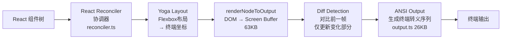

# 第 7 章：用户体验设计

> 好用 = 模型能力 x 交互设计 x 工程约束

## 7.1 设计哲学

Claude Code 的用户体验设计遵循一个核心理念：**让用户感知到 Agent 的每一步操作，同时尽量减少干预的需要**。

这不是一个"后台默默执行"的工具，也不是一个"每步都要确认"的工具。它在透明度和自主性之间找到了平衡：
- 所有工具调用**实时可见**
- 只在需要权限确认时才中断用户
- 流式输出让用户能**边看边决策**是否中断

## 7.2 Ink/React 终端 UI

Claude Code 使用**自研的 Ink 终端渲染器**（基于 React），核心模块 `src/ink/ink.tsx` 达 251KB。这不是简单的 console.log 输出——它是一个完整的 React 应用，运行在终端中。

### 渲染流水线



### 内存优化

Screen Buffer（`src/ink/screen.ts`，49KB）使用三种对象池避免 GC 压力：

| 对象池 | 作用 | 优化手段 |
|--------|------|---------|
| CharPool | 重复字符 intern 化 | ASCII 快速路径：直接数组查找 |
| StylePool | 重复样式 intern 化 | 位打包存储样式元数据 |
| HyperlinkPool | 重复 URL intern 化 | URL 去重 |

跨帧优化：
- **Blitting**：从前一帧复制未变化区域
- **代际重置**：帧间替换池，防止内存膨胀

### 核心组件

| 组件 | 功能 |
|------|------|
| `App.tsx` (98KB) | 根组件，键盘/鼠标/焦点事件分发 |
| `Box.tsx` | Flexbox 布局容器 |
| `Text.tsx` | 样式化文本渲染 |
| `ScrollBox.tsx` | 可滚动容器（支持文本选择） |
| `Button.tsx` | 交互式按钮（焦点/点击） |
| `AlternateScreen.tsx` | 全屏模式 |
| `Ansi.tsx` | ANSI 转义码解析为 React Text |

## 7.3 流式输出

Claude Code 的流式输出不是"等完了再显示"，而是**真正的实时流式渲染**。

从 API 到用户终端，整个链路基于 `async function*` 异步生成器：

```
API SSE → callModel() → query() → QueryEngine → REPL → Ink 渲染器
     ↓          ↓            ↓           ↓          ↓
   chunk      yield       yield       yield     React 更新
```

每个 Token 从 API 返回的瞬间就开始渲染，用户可以实时看到模型的"思考过程"。

### 流式事件类型

| 事件类型 | 来源 | 处理 |
|---------|------|------|
| `message_start` | API | 更新 usage |
| `content_block_delta` | API | 实时渲染文本 |
| `message_delta` | API | 累积 Token 计数 |
| `message_stop` | API | 累加到 totalUsage |
| `stream_event` | query() | 条件 yield |
| `progress` | 工具 | 行内进度更新 |

## 7.4 工具调用透明度

每个工具调用都通过 React 组件实时展示。每个 Tool 接口定义了自己的渲染方法：

```typescript
// 每个工具自带 4 种渲染
renderToolUseMessage(input, options): React.ReactNode       // 工具调用显示
renderToolResultMessage?(content, progress): React.ReactNode // 结果显示
renderToolUseRejectedMessage?(input): React.ReactNode        // 拒绝显示
renderToolUseErrorMessage?(result): React.ReactNode          // 错误显示
```

用户可以实时看到：
- 模型打算执行什么工具，带什么参数
- 工具执行的进度（Bash 命令的 stdout）
- 工具的结果或错误
- 权限确认对话框（如果需要）

### 工具分组渲染

`renderGroupedToolUse?()` 方法支持将多个同类型工具调用合并渲染，减少视觉噪音。例如多个文件读取可以合并显示为一个列表。

## 7.5 错误处理与恢复

Claude Code 的错误处理策略是"尽可能自动恢复，实在不行才告诉用户"：

### 用户无感知的自动恢复

- **PTL 错误**：自动触发 Context Collapse 排水或反应式压缩
- **Max-Output-Tokens**：自动升级 Token 限制或注入续写提示
- **API 5xx 错误**：自动重试（最多 10 次，指数退避）
- **连接重置**：自动禁用 Keep-Alive 后重试
- **OAuth 过期**：自动刷新 Token

### 需要用户干预的错误

- **API Key 无效**：提示重新认证
- **模型不可用**：提示选择其他模型
- **权限拒绝后的工具失败**：显示失败原因
- **预算超限**：显示已用成本并终止

### 模型降级通知

当连续 3 次 529 错误触发模型降级时：

```
连续 3 次 529 → 抛出 FallbackTriggeredError
  → 清除之前的 assistant 消息
  → 剥离思考签名块
  → yield 系统消息告知用户降级
  → 用降级模型重试
```

用户会看到一条系统消息说明模型已降级，但不需要任何操作。

## 7.6 键盘快捷键

Claude Code 支持丰富的键盘快捷键，部分通过技能文档暴露：

| 快捷键 | 功能 |
|--------|------|
| Enter | 提交消息 |
| Ctrl+C | 中断当前操作 |
| Ctrl+R | 搜索历史 |
| Escape | 中止权限对话框 |
| Tab | 自动补全 |

## 7.7 Vim 模式

`src/vim/` 实现了终端输入的 Vim 键绑定（总计约 40KB）：

```typescript
// 状态机：Normal → Insert → Visual → Command
operators.ts   (16KB) // 操作符：delete, yank, change
transitions.ts (12KB) // 模式转换
motions.ts     (1.9KB) // 移动：word, line, char
textObjects.ts (5KB)   // 文本对象：word, paragraph
```

这使得习惯 Vim 的用户可以在 Claude Code 的输入框中使用熟悉的编辑模式。

## 7.8 REPL 主界面

`src/screens/REPL.tsx`（895KB）是整个应用的主要交互界面。它集成了：

- 流式消息处理（`handleMessageFromStream`）
- 工具执行编排
- 权限请求处理（`PermissionRequest` 组件）
- 消息压缩（`partialCompactConversation`）
- 搜索历史（`useSearchInput`）
- 会话恢复和 Worktree 管理
- 后台任务协调
- 成本追踪和速率限制
- 虚拟滚动（`VirtualMessageList`）

### 虚拟消息列表

对于长对话，`VirtualMessageList` 实现虚拟滚动——只渲染可见区域的消息。这在数百条消息的对话中避免了渲染性能问题。

## 7.9 终端协议支持

`src/ink/termio/` 处理底层终端协议，支持多种高级特性：

| 特性 | 协议 | 说明 |
|------|------|------|
| 超链接 | OSC 8 | 可点击的链接 |
| 鼠标追踪 | Mode-1003/1000 | 移动/点击事件 |
| 键盘 | Kitty Protocol | 扩展键码 |
| 文本选择 | 自定义 | 单词/行吸附 |
| 搜索高亮 | 自定义 | 带位置追踪 |
| 双向文本 | bidi.ts | RTL 语言支持 |
| 点击测试 | Hit Testing | 精确元素定位 |

## 7.10 诊断界面

`src/screens/Doctor.tsx`（73KB）提供系统诊断功能：

```
┌─────────────────────────────────────┐
│           Claude Code Doctor        │
│                                     │
│  ✓ API 连接            正常         │
│  ✓ 认证状态            已登录       │
│  ✓ 模型可用性          3 模型可用    │
│  ✗ MCP 服务端 "foo"    连接超时     │
│  ✓ 插件 "bar"          已加载       │
│  ✓ Git 状态            main 分支    │
│  ✓ 配置验证            无错误       │
└─────────────────────────────────────┘
```

## 7.11 成本与使用量展示

每次对话结束时，Claude Code 展示：
- Token 使用量（输入/输出/缓存）
- USD 成本
- 轮次数
- 停止原因

成本追踪是 fire-and-forget 方式——不阻塞查询，但始终保持准确的累积计算。

## 7.12 设计洞察

1. **React in Terminal 不是玩具**：251KB 的自研 Ink 渲染器证明了终端 UI 可以做到 Web 级别的交互体验
2. **流式是用户体验的核心**：实时看到模型思考过程，比等 10 秒看到完整结果更好
3. **工具透明度建立信任**：用户能看到每一步操作，才愿意给 Agent 更多权限
4. **自动恢复减少干扰**：大多数错误在用户感知之前就被修复了
5. **渲染与逻辑耦合**：每个工具自带渲染方法，确保展示与行为一致

---

上一章：[权限与安全](./06-permission-security.md) | 下一章：[最小必要组件](./08-minimal-components.md)
