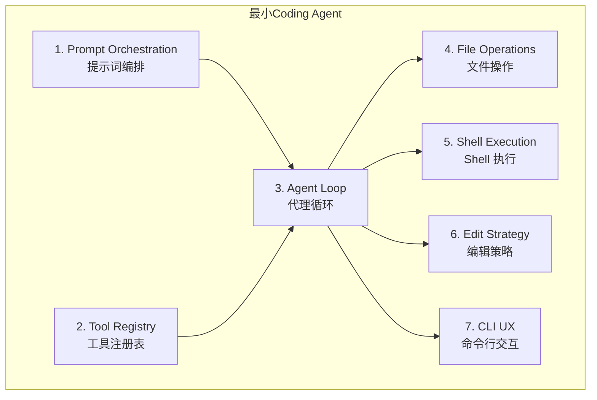

# 第 8 章：最小必要组件

> 从 512K+ 行源码到可运行的最小 coding agent——你真正需要的是什么？

## 8.1 为什么需要"最小必要"视角

Claude Code 是一个生产级系统，512K+ 行代码覆盖了从 OAuth 到 MCP 到 Vim 模式的方方面面。但如果你想从零构建一个 coding agent，你不需要 all of this。

[claude-code-from-scratch](https://github.com/Windy3f3f3f3f/claude-code-from-scratch) 项目就是做这件事：提炼出最小必要组件，帮助你理解 coding agent 的本质。

## 8.2 七个最小必要组件

构建一个可用的 coding agent，至少需要以下 7 个组件：



### 组件 1：Prompt Orchestration（提示词编排）

Claude Code 中的对应：`src/context.ts` + `src/utils/api.ts` + 系统提示词

**最小实现需要**：
- 一个系统提示词，告诉模型它是一个 coding agent
- 工作目录和项目上下文注入
- 可用工具的描述

**Claude Code 的做法**：
- `getSystemContext()` 注入 git 状态（分支、暂存、最近提交）
- `getUserContext()` 注入 CLAUDE.md 项目指令
- 工具描述通过 `tool.prompt()` 和 `tool.description()` 动态生成
- 多层缓存控制优化提示词缓存命中率

**最小版本可以省略**：
- CLAUDE.md 发现机制
- 提示词缓存策略
- 记忆系统

### 组件 2：Tool Registry（工具注册表）

Claude Code 中的对应：`src/Tool.ts` + `src/tools.ts`

**最小实现需要**：
- 统一的工具接口定义
- 工具名称到实现的映射
- Zod 或 JSON Schema 输入验证

**Claude Code 的做法**：
- `Tool<Input, Output, P>` 泛型接口，30+ 方法/属性
- `getAllBaseTools()` 返回 66+ 工具
- Feature-gated 条件加载
- MCP 桥接工具动态注入

**最小版本可以省略**：
- Feature Flag 系统
- MCP 集成
- 延迟加载（ToolSearch）
- React 渲染方法

### 组件 3：Agent Loop（代理循环）

Claude Code 中的对应：`src/query.ts` + `src/QueryEngine.ts`

**最小实现需要**：
```
while true:
  response = callModel(messages, tools)
  if response has tool_calls:
    for tool_call in tool_calls:
      result = executeTool(tool_call)
      messages.append(tool_result)
  else:
    break  // 模型没有调用工具，结束
```

**Claude Code 的做法**：
- 1,728 行的 `query()` 异步生成器
- 7 个 Continue Sites 对应 7 种恢复策略
- 4 级压缩流水线
- 流式工具并行执行
- 错误扣留与自动恢复
- Token 预算追踪

**最小版本可以省略**：
- 压缩系统（短对话不需要）
- 流式工具并行执行
- 错误恢复机制
- Token 预算管理

### 组件 4：File Operations（文件操作）

Claude Code 中的对应：`src/tools/FileReadTool/` + `src/tools/GrepTool/` + `src/tools/GlobTool/`

**最小实现需要**：
- 读取文件内容
- 搜索文件内容（grep）
- 查找文件（glob/find）

**Claude Code 的做法**：
- FileReadTool 支持文本、图片、PDF、Jupyter
- GrepTool 基于 ripgrep，支持正则、行号、上下文
- GlobTool 支持多种 glob 模式

**最小版本可以省略**：
- PDF/图片/Jupyter 支持
- 大结果持久化到磁盘

### 组件 5：Shell Execution（Shell 执行）

Claude Code 中的对应：`src/tools/BashTool/`

**最小实现需要**：
- 执行 Shell 命令
- 捕获 stdout/stderr
- 超时控制

**Claude Code 的做法**：
- 7 层安全验证
- 23 项静态检查器
- tree-sitter AST 分析
- 沙箱模式
- 后台任务管理
- 命令分类（搜索/读取/列表/中性）

**最小版本可以省略**：
- AST 分析（可用简单的黑名单替代）
- 沙箱
- 后台任务
- 命令分类

### 组件 6：Edit Strategy（编辑策略）

Claude Code 中的对应：`src/tools/FileEditTool/` + `src/tools/FileWriteTool/`

**最小实现需要**：
- search-and-replace 精确编辑
- 全文件写入（创建新文件）
- 编辑前读取验证

**Claude Code 的做法**：
- FileEditTool：唯一性约束、`replace_all` 选项
- FileWriteTool：完整覆盖写入
- 读取状态缓存（`readFileState`）
- NotebookEditTool（Jupyter）

**最小版本可以省略**：
- Notebook 支持
- 复杂的读取状态缓存

### 组件 7：CLI UX（命令行交互）

Claude Code 中的对应：`src/screens/REPL.tsx` + `src/ink/`

**最小实现需要**：
- 读取用户输入
- 显示模型输出
- 显示工具调用和结果

**Claude Code 的做法**：
- 自研 Ink 渲染器（251KB）
- React 组件化 UI
- 虚拟滚动
- Vim 模式
- 鼠标追踪
- OSC 8 超链接

**最小版本可以省略**：
- React 渲染器（用 console.log 足够）
- 虚拟滚动
- Vim 模式
- 所有高级终端协议

## 8.3 从最小到生产：渐进式增强路线


### 阶段 1：最小可用（~500 行）

```
用户输入 → 系统提示词 + 消息 → API 调用 → 工具执行 → 循环
```

工具：FileRead、FileWrite、FileEdit、Bash、Grep

### 阶段 2：基础增强（~2000 行）

新增：
- 权限确认对话框（危险命令需确认）
- 对话历史持久化
- 基础错误处理（重试）

### 阶段 3：体验优化（~5000 行）

新增：
- 流式输出（async generator）
- 自动错误恢复（PTL、MOT）
- Token 使用量追踪
- 成本显示

### 阶段 4：生产就绪（~20000 行）

新增：
- 4 级压缩流水线
- Bash AST 安全分析
- MCP 协议集成
- 多 Agent（AgentTool）
- 提示词缓存优化

## 8.4 claude-code-from-scratch 项目

[claude-code-from-scratch](https://github.com/Windy3f3f3f3f/claude-code-from-scratch) 项目提供了一个可运行的最小实现，帮助你：

1. **理解核心机制**：不被 512K 行代码淹没
2. **动手实验**：修改循环逻辑、添加新工具
3. **学习设计决策**：理解每个组件为什么存在
4. **渐进式构建**：从最小版本逐步添加功能

## 8.5 最小版本 vs 生产版本的关键差异

| 维度 | 最小版本 | Claude Code 生产版本 |
|------|---------|-------------------|
| 上下文管理 | 不压缩 | 4 级压缩流水线 |
| 安全 | 简单黑名单 | 7 层验证 + 23 项检查 |
| 并发 | 串行执行 | 只读并行 + 流式工具执行 |
| 错误处理 | 直接报错 | 错误扣留 + 自动恢复 |
| UI | console.log | React + Ink 终端渲染器 |
| 扩展性 | 硬编码工具 | MCP + 插件 + 技能 |
| 多 Agent | 无 | AgentTool + 协调器 + Swarm |
| 缓存 | 无 | 多层提示词缓存 + 断裂检测 |

## 8.6 核心洞察

构建 coding agent 的最大误区是认为"写一个好的 prompt 就够了"。实际上：

1. **循环才是核心**：Agent 的价值不在单次调用，而在持续的工具循环
2. **编辑策略决定可用性**：search-and-replace 比全文件写入安全得多
3. **上下文管理决定上限**：没有压缩系统，长对话就不可能
4. **安全不是可选的**：在用户环境中执行代码，安全是前提
5. **体验是乘数效应**：同样的模型能力，好的交互设计让体验翻倍

---

上一章：[用户体验设计](./07-user-experience.md) | 下一章：[Hooks 与可扩展性](./09-hooks-extensibility.md)
