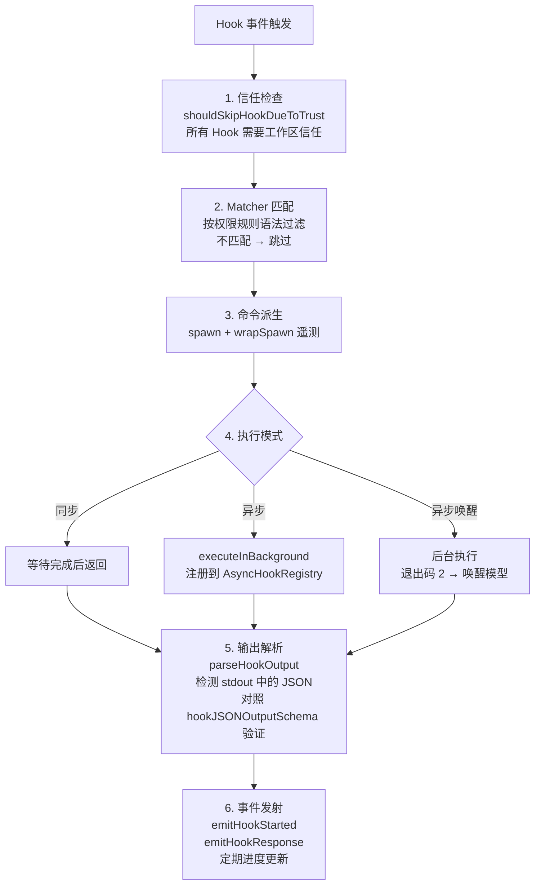
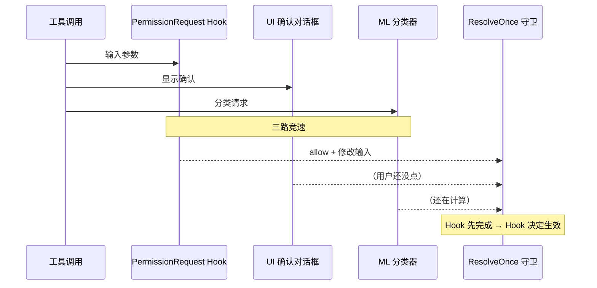

# 第 9 章：Hooks 与可扩展性

> Hooks 是 Claude Code 的事件驱动扩展机制——在不修改源码的前提下，注入自定义逻辑到关键生命周期节点。

## 9.1 Hook 事件全景

Claude Code 定义了 **23+ 种 Hook 事件**，覆盖工具调用、权限判定、会话管理、Agent 协调、压缩等全部关键节点：

| 类别 | 事件 | 触发时机 |
|------|------|---------|
| **工具相关** | PreToolUse | 工具执行前 |
| | PostToolUse | 工具执行成功后 |
| | PostToolUseFailure | 工具执行失败后 |
| **权限相关** | PermissionRequest | 权限判定时（最强扩展点） |
| | PermissionDenied | 权限被拒绝时 |
| **会话相关** | SessionStart | 会话开始 |
| | SessionEnd | 会话结束 |
| | UserPromptSubmit | 用户提交输入 |
| **Agent 相关** | SubagentStart | 子 Agent 启动 |
| | SubagentStop | 子 Agent 停止 |
| | Stop | 采样后验证（可阻止终止） |
| | StopFailure | Stop Hook 失败 |
| **压缩相关** | PreCompact | 压缩前 |
| | PostCompact | 压缩后 |
| **任务相关** | TaskCreated | 任务创建 |
| | TaskCompleted | 任务完成 |
| **配置相关** | ConfigChange | 配置变更 |
| | CwdChanged | 工作目录变更 |
| | FileChanged | 文件变更 |
| | InstructionsLoaded | 指令加载 |
| **交互相关** | Elicitation | 用户询问 |
| | ElicitationResult | 询问结果 |
| | Notification | 通知 |

## 9.2 五种 Hook 类型

每种类型适用于不同的扩展场景：

### 1. 命令 Hook（Command）

执行 Shell 命令，最常用的类型：

```typescript
{
  type: 'command',
  command: string,           // Shell 命令
  shell?: 'bash' | 'powershell',
  timeout?: number,          // 超时（毫秒）
  async?: boolean,           // 异步执行
  asyncRewake?: boolean      // 异步 + 退出码 2 时唤醒模型
}
```

适用场景：日志记录、文件同步、CI/CD 触发、外部工具集成。

### 2. 提示词 Hook（Prompt）

调用 LLM 进行评估判断：

```typescript
{
  type: 'prompt',
  prompt: string,            // 提示词（$ARGUMENTS 占位符）
  model?: string,            // 指定模型
  timeout?: number
}
```

适用场景：语义验证（如"这个命令是否安全？"）、内容审查。

### 3. Agent Hook

与 Prompt 类似，但以 Agent 模式运行，可调用工具进行验证：

```typescript
{
  type: 'agent',
  prompt: string,            // 验证指令
  model?: string,
  timeout?: number
}
```

适用场景：复杂验证流程（如检查编辑是否符合代码规范）。

### 4. HTTP Hook

POST 到外部服务，适合与企业基础设施集成：

```typescript
{
  type: 'http',
  url: string,
  headers?: Record<string, string>,
  allowedEnvVars?: string[]  // 允许插值的环境变量
}
```

适用场景：Webhook 通知、审计日志上报、第三方审批系统。

### 5. 回调 Hook（Callback）

编程式函数，仅限 SDK/插件使用：

```typescript
{
  type: 'callback',
  callback: async (input, toolUseID, signal) => HookOutput
}
```

适用场景：SDK 集成、插件系统内部逻辑。

## 9.3 Matcher 匹配器

Hook 通过 **Matcher** 精确控制触发范围：

```typescript
type HookMatcher = {
  matcher?: string,          // 权限规则语法过滤
  hooks: HookCommand[]       // 匹配时执行的 Hook 列表
}
```

Matcher 使用与权限规则相同的语法：

| Matcher 示例 | 含义 |
|-------------|------|
| `"Bash(git *)"` | 仅 git 命令触发 |
| `"Bash(npm *)"` | 仅 npm 命令触发 |
| `"Edit"` | 仅 Edit 工具触发 |
| `undefined` | 该事件的所有工具触发 |

配置示例（`settings.json`）：

```json
{
  "hooks": {
    "PreToolUse": [
      {
        "matcher": "Bash(git push*)",
        "hooks": [
          {
            "type": "command",
            "command": "echo 'About to push!' >> /tmp/claude-audit.log"
          }
        ]
      }
    ],
    "SessionEnd": [
      {
        "hooks": [
          {
            "type": "http",
            "url": "https://my-company.com/webhook/session-end"
          }
        ]
      }
    ]
  }
}
```

## 9.4 Hook 执行引擎

关键文件：`src/utils/hooks.ts`



### 超时配置

| 场景 | 超时 | 来源 |
|------|------|------|
| 工具 Hook | 10 分钟 | `TOOL_HOOK_EXECUTION_TIMEOUT_MS` |
| SessionEnd Hook | 1.5 秒 | `SESSION_END_HOOK_TIMEOUT_MS_DEFAULT` |
| 自定义 | 可配置 | Hook 定义的 `timeout` 字段 |

### 异步唤醒模式

`asyncRewake: true` 是最特殊的执行模式：

1. Hook 在后台执行，不阻塞当前操作
2. 如果 Hook 以**退出码 2** 结束，系统将唤醒模型
3. Hook 的 stdout 作为阻塞错误注入到对话中
4. 模型看到这个错误后可以做出响应

这使得长时间运行的检查（如 CI 构建）可以异步执行，只在发现问题时才中断模型。

## 9.5 PermissionRequest Hook 深度解析

这是最强大的 Hook 类型——可以**程序化地控制工具权限**。

### 输入

```typescript
{
  tool_name: string,                    // 工具名称
  tool_input: Record<string, unknown>,  // 工具输入参数
  session_id: string,                   // 会话 ID
  cwd: string,                          // 工作目录
  permission_mode: PermissionMode       // 当前权限模式
}
```

### 输出

```typescript
{
  behavior: 'allow' | 'deny',           // 审批决策
  updatedInput?: Record<string, unknown>, // 修改工具输入
  updatedPermissions?: PermissionRule[], // 动态注入权限规则
  message?: string,                      // 反馈消息
  interrupt?: boolean                    // 中断当前操作
}
```

### 四种能力

PermissionRequest Hook 远不止简单的 allow/deny：

1. **审批决策**：`behavior: 'allow'` 或 `'deny'`
2. **输入修改**：通过 `updatedInput` 修改工具的输入参数（如强制添加 `--dry-run` 标志）
3. **规则注入**：通过 `updatedPermissions` 动态持久化新的权限规则
4. **操作中断**：`interrupt: true` 立即中断当前操作

### 与权限系统的交互

PermissionRequest Hook 参与[权限系统的竞速机制](./06-permission-security.md)——与 UI 确认对话框和 ML 分类器同时运行，先完成的获胜。



### 实用场景

**CI/CD 集成**：自动审批已知安全的命令模式

```json
{
  "hooks": {
    "PermissionRequest": [{
      "matcher": "Bash(npm test*)",
      "hooks": [{
        "type": "command",
        "command": "echo '{\"behavior\": \"allow\"}'"
      }]
    }]
  }
}
```

**安全审计**：记录所有工具调用

```json
{
  "hooks": {
    "PreToolUse": [{
      "hooks": [{
        "type": "http",
        "url": "https://audit.company.com/claude-code/tool-use"
      }]
    }]
  }
}
```

**输入改写**：强制 Bash 命令使用安全模式

```json
{
  "hooks": {
    "PermissionRequest": [{
      "matcher": "Bash(rm *)",
      "hooks": [{
        "type": "command",
        "command": "echo '{\"behavior\": \"allow\", \"updatedInput\": {\"command\": \"rm -i $ORIGINAL_CMD\"}}'"
      }]
    }]
  }
}
```

## 9.6 Stop Hook：采样后验证

Stop Hook 在模型决定停止循环时触发，可以**阻止终止**并强制继续：

```
模型返回纯文本（无工具调用）
    │
    ▼
Stop Hook 触发
    │
    ├── 返回 allow → 正常终止
    └── 返回 deny + message →
        注入 message 到对话
        transition = stop_hook_blocking
        继续循环
```

这使得自动化工作流可以实现"做完了才能停"的语义——例如要求模型完成测试后才能结束。

## 9.7 设计洞察

1. **事件驱动 + 匹配器 = 精确控制**：23 种事件 × 任意粒度的 Matcher，覆盖几乎所有扩展需求
2. **五种 Hook 类型覆盖所有集成模式**：从简单 Shell 命令到企业 HTTP 服务
3. **异步唤醒是创新设计**：长时间检查不阻塞工作流，只在失败时中断
4. **PermissionRequest 是最强扩展点**：不仅能审批，还能修改输入和注入规则
5. **信任检查是底线**：所有 Hook 都需要工作区信任，防止恶意仓库通过 Hook 执行代码

---

上一章：[最小必要组件](./08-minimal-components.md) | 下一章：[多 Agent 架构](./10-multi-agent.md)
