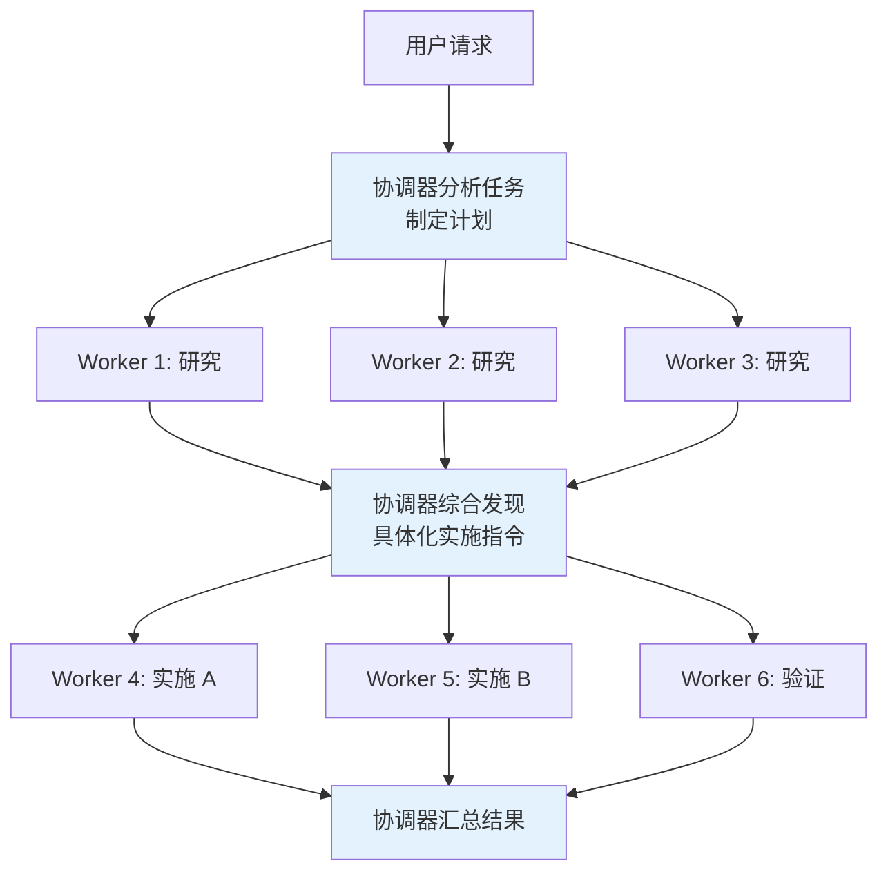
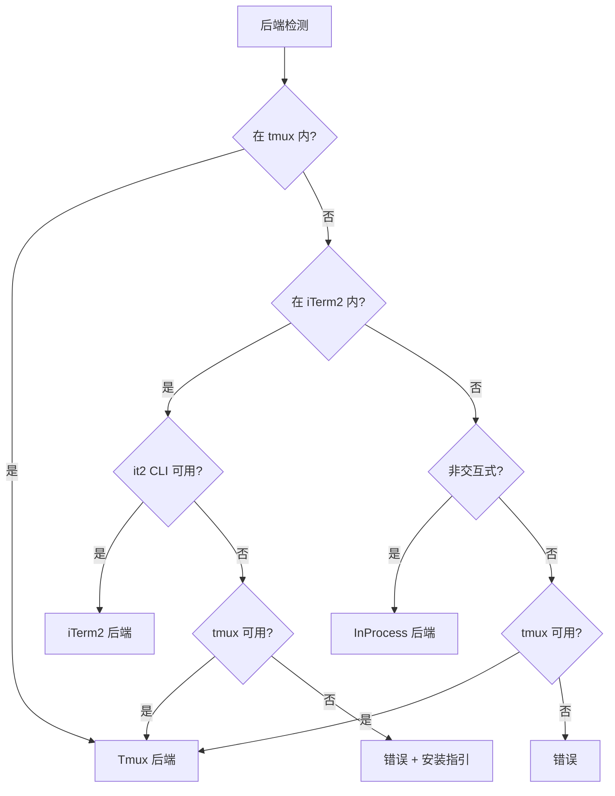

# 第 10 章：多 Agent 架构

> 从单个 Agent 到 Agent 团队——Claude Code 如何协调多个 Agent 并行完成复杂任务。

## 10.1 三种多 Agent 模式

Claude Code 支持三种多 Agent 协作模式，适用于不同复杂度的场景：

```mermaid
graph LR
    subgraph 模式1 ["子 Agent (AgentTool)"]
        P1[父 Agent] -->|fork| C1[子 Agent]
        C1 -->|返回结果| P1
    end

    subgraph 模式2 ["协调器 (Coordinator)"]
        CO[协调器<br/>只分配不执行] -->|派生| W1[Worker 1]
        CO -->|派生| W2[Worker 2]
        CO -->|派生| W3[Worker 3]
        W1 -->|结果| CO
        W2 -->|结果| CO
        W3 -->|结果| CO
    end

    subgraph 模式3 ["Swarm 团队"]
        T1[Agent A] <-->|信箱通信| T2[Agent B]
        T2 <-->|信箱通信| T3[Agent C]
        T1 <-->|信箱通信| T3
    end
```



| 模式 | 适用场景 | 通信方式 | 特点 |
|------|---------|---------|------|
| **子 Agent** | 单个独立子任务 | fork-return | 最简单，父 Agent 等待结果 |
| **协调器** | 复杂多步任务 | 派生 + 综合 | 协调器不执行，只编排 |
| **Swarm 团队** | 并行协作任务 | 命名信箱 | Agent 间对等通信 |

## 10.2 子 Agent 模式（AgentTool）

这是最基础的多 Agent 模式。父 Agent 通过 [AgentTool](./04-tool-system.md) 派生子 Agent 执行独立任务：

```typescript
{
  description: string,           // 3-5 词任务描述
  prompt: string,                // 任务指令
  subagent_type?: string,        // 专用 Agent 类型
  model?: 'sonnet' | 'opus' | 'haiku',
  run_in_background?: boolean,   // 异步执行
  name?: string,                 // 可寻址名称
  isolation?: 'worktree' | 'remote'  // 隔离模式
}
```

### 四种执行模式

| 模式 | 实现 | 结果传递 | 适用场景 |
|------|------|---------|---------|
| **同步** | 进程内直接执行 | 结果嵌入父对话 | 简单子任务 |
| **异步** | `LocalAgentTask` | 文件轮询获取结果 | 长时间任务 |
| **队友** | Tmux/iTerm2 会话 | 信箱通信 | 并行协作 |
| **远程** | `RemoteAgentTask` | WebSocket 流式 | CCR 环境 |

### 隔离模式

**Git Worktree 隔离**：子 Agent 在独立的 Git Worktree 中工作，防止多个 Agent 同时修改同一文件：

```
主仓库 (main branch)
├── Agent A 在此工作
│
├── .git/worktrees/
│   ├── worktree-abc/     ← Agent B 的隔离副本
│   └── worktree-def/     ← Agent C 的隔离副本
```

- 无修改时自动清理 Worktree
- 有修改时返回 Worktree 路径和分支名
- 用户决定是否合并

## 10.3 协调器模式（Coordinator）

协调器模式（Feature-gated: `COORDINATOR_MODE`）将主 Agent 转变为**纯编排者**——只负责分析任务、分配 Worker、综合结果，永远不直接操作文件。

关键文件：`src/coordinator/coordinatorMode.ts`

### 协调器可用工具

协调器的工具集被严格限制：

| 工具 | 用途 |
|------|------|
| `Agent` | 派生新 Worker |
| `SendMessage` | 继续已有 Worker |
| `TaskStop` | 终止 Worker |

协调器**不能**使用 Bash、Edit、Read 等工具——这确保它只做编排。

### Worker 工具集

Worker 根据模式获得不同的工具：
- **简单模式**：Bash, Read, Edit
- **完整模式**：`ASYNC_AGENT_ALLOWED_TOOLS` 中的所有工具
- MCP 工具自动可用
- 技能通过 SkillTool 委托

### 标准工作流



### 五条关键设计原则

1. **协调器不执行**：只负责分配和综合，永远不直接操作文件
2. **研究 → 综合 → 实施 → 验证**：标准四阶段工作流
3. **精确指令**：综合后下发的实施指令必须包含具体文件路径、行号和修改内容
4. **独立验证**：验证 Worker 独立测试，不能"橡皮图章"
5. **同文件串行**：多个 Worker 写同一文件时必须串行化，防止冲突

## 10.4 Swarm 执行后端

Swarm 系统支持创建**命名 Agent 团队**，Agent 之间通过信箱对等通信。

关键文件：`src/utils/swarm/backends/`

### 三种后端



| 后端 | 实现方式 | 特点 |
|------|---------|------|
| **Tmux** | 创建/管理 tmux 分屏面板 | 支持隐藏/显示，最常用 |
| **iTerm2** | 原生 iTerm2 面板（via `it2` CLI） | macOS 原生体验 |
| **InProcess** | 同一 Node.js 进程内运行 | AsyncLocalStorage 隔离，共享 API 客户端和 MCP 连接 |

### 统一接口

所有后端实现统一的 `TeammateExecutor` 接口：

```typescript
interface TeammateExecutor {
  spawn(config): Promise<void>              // 创建队友
  sendMessage(agentId, message): Promise<void>  // 发送消息
  terminate(agentId, reason): Promise<void> // 优雅关闭
  kill(agentId): Promise<void>              // 立即终止
  isActive(agentId): boolean                // 检查存活
}
```

## 10.5 Worker 结果传递

Worker 完成后，结果以 `<task-notification>` XML 格式传递给协调器或父 Agent：

```xml
<task-notification>
  <task-id>ae9a65ee22594487c</task-id>
  <status>completed</status>
  <summary>Agent "research query engine" completed</summary>
  <result>
    ... 详细结果内容 ...
  </result>
  <usage>
    <total_tokens>71330</total_tokens>
    <tool_uses>21</tool_uses>
    <duration_ms>81748</duration_ms>
  </usage>
</task-notification>
```

关键字段：
- `status`：completed / failed / stopped
- `usage`：Token 使用量、工具调用次数、耗时——用于成本追踪
- `result`：Worker 的文本输出，协调器据此做综合决策

## 10.6 设计洞察

1. **协调器不执行是核心约束**：防止协调器既做决策又做执行，保证任务分配的客观性
2. **后端检测优先级考虑用户环境**：tmux > iTerm2 > InProcess，最大化利用已有终端能力
3. **隔离模式防止冲突**：Worktree 隔离确保多个 Agent 不会同时修改同一文件
4. **XML 结果格式保证结构化**：`<task-notification>` 格式让协调器能可靠解析 Worker 结果
5. **三种模式覆盖不同复杂度**：简单任务用子 Agent，复杂任务用协调器，并行协作用 Swarm

---

上一章：[Hooks 与可扩展性](./09-hooks-extensibility.md) | 下一章：[记忆与技能系统](./11-memory-skills.md)
