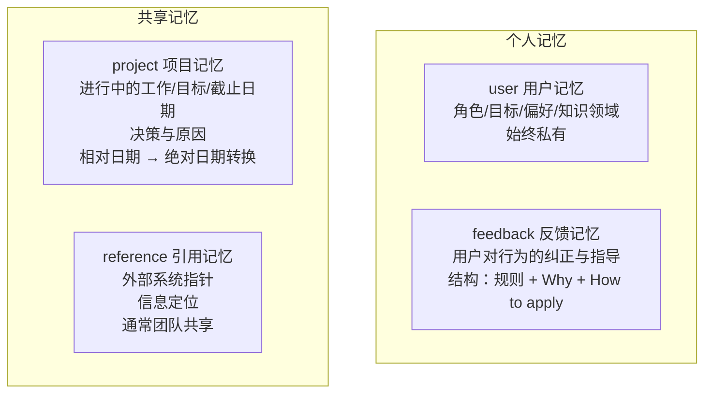
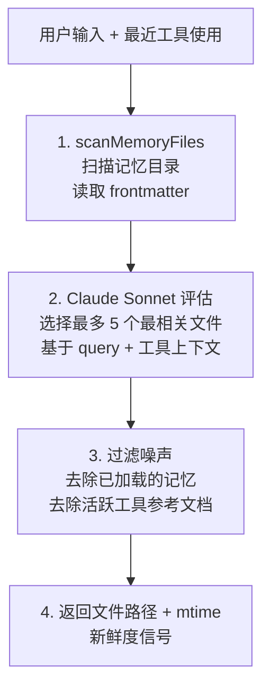
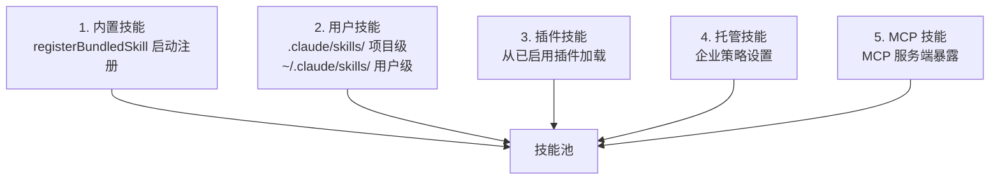
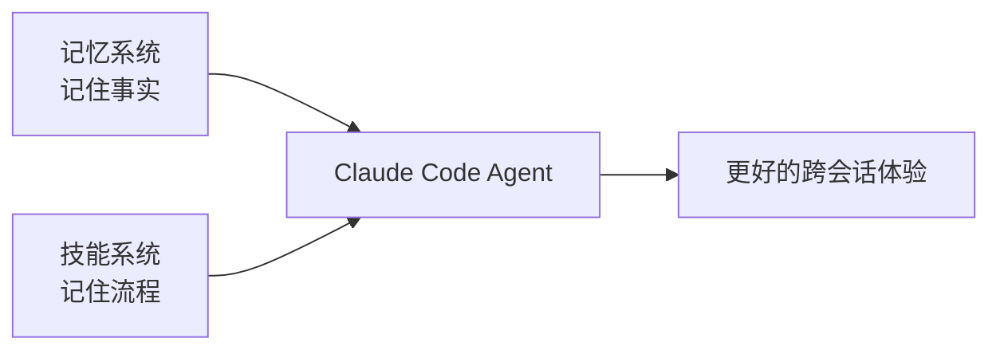

# 第 11 章：记忆与技能系统

> 记忆让 Agent 记住事实，技能让 Agent 记住流程——共同构成一个跨会话学习的编程助手。

## 11.1 记忆系统

Claude Code 的记忆系统旨在跨会话保持对用户、项目和工作流的理解。

核心约束：**只记忆不可从当前项目状态推导的信息**。代码模式、架构、git 历史等应该通过读取当前代码获取，不需要记忆。

关键文件：`src/memdir/`

### 四种记忆类型



| 类型 | 记什么 | 示例 |
|------|--------|------|
| **user** | 用户身份、偏好、知识背景 | "用户是数据科学家，专注可观测性" |
| **feedback** | 对 Agent 行为的纠正 | "不要在响应末尾总结，用户能自己看 diff" |
| **project** | 项目进展、决策、截止日期 | "2026-03-05 合并冻结，移动端发布" |
| **reference** | 外部系统的定位信息 | "管道 Bug 追踪在 Linear INGEST 项目" |

### 存储格式

每条记忆是独立的 Markdown 文件，带 YAML frontmatter：

```markdown
---
name: 简洁回复偏好
description: 用户不希望在响应末尾看到总结
type: feedback
---

不要在每次响应末尾总结已完成的操作。

**Why:** 用户明确表示可以自己阅读 diff。
**How to apply:** 所有响应保持简洁，省略尾部总结。
```

### MEMORY.md 索引

`MEMORY.md` 是记忆系统的**索引文件**，不是记忆容器。最大 200 行或 25KB：

```markdown
- [用户角色](user_role.md) — 数据科学家，专注可观测性
- [简洁回复偏好](feedback_terse.md) — 不要尾部总结
- [合并冻结](project_freeze.md) — 2026-03-05 移动端发布冻结
- [Bug 追踪](reference_linear.md) — 管道 Bug 在 Linear INGEST 项目
```

MEMORY.md 每次会话自动加载到上下文中。Agent 通过读取索引中的描述来判断哪些记忆可能与当前任务相关。

### 记忆召回机制



关键设计：
- 使用 **Claude Sonnet**（而非规则匹配）进行语义相关性评估
- 每轮最多召回 5 个记忆文件
- `mtime`（修改时间）作为新鲜度信号——更近修改的记忆权重更高
- 通过 `pendingMemoryPrefetch` 在模型生成的同时预取，不阻塞主循环

### 记忆漂移警告

记忆记录的是**写入时的事实**。时间会让记忆过时。在依据记忆行动前：

1. 读取当前文件验证
2. 检查 git log 确认变更
3. 更新或删除过时的记忆

## 11.2 技能系统

技能（Skills）是 Claude Code 的**可复用行为模板**，相当于"AI 的 shell 脚本"。用户通过 `/skill-name` 调用。

关键文件：`src/skills/`

### 技能来源与优先级



优先级从高到低：内置 > 用户 > 插件 > 托管 > MCP。

### 内置技能清单

**始终注册**：

| 技能 | 用途 |
|------|------|
| `updateConfig` | 修改 settings.json 配置 |
| `keybindings` | 快捷键参考 |
| `verify` | 验证工作流 |
| `debug` | 调试工具 |
| `simplify` | 代码简化审查 |
| `batch` | 批量操作 |
| `stuck` | 卡住时的帮助 |
| `remember` | 显式保存记忆 |
| `skillify` | Markdown 脚本转技能 |
| `claudeApi` | Claude API 辅助（Feature-gated） |
| `loop` | 类 Cron 的 Agent 触发（Feature-gated） |

### 技能结构

技能文件是 Markdown + YAML frontmatter：

```markdown
---
name: my-skill
description: 描述
aliases: [ms]
whenToUse: 自动触发描述
argumentHint: 参数提示
allowedTools: [Bash, Edit]    # 限制可用工具
model: claude-sonnet           # 指定模型
context: inline | fork         # 执行上下文
hooks:                         # 技能级 Hook
  PreToolUse:
    - matcher: "Bash(*)"
      hooks:
        - type: command
          command: "echo checking"
---

技能提示词内容...
可以引用 $ARGUMENTS 占位符
```

### 执行上下文

| 上下文 | 行为 | 适用场景 |
|--------|------|---------|
| `inline` | 在当前对话内注入提示词 | 简单指令、行为修改 |
| `fork` | 作为独立子 Agent 执行 | 复杂任务、独立上下文 |

`inline` 技能直接影响当前对话——提示词注入后，模型在当前上下文中执行。`fork` 技能创建独立的子 Agent，完成后返回结果。

### 技能去重

通过 `realpath()` 解析符号链接检测重复——相同规范路径的技能视为同一个，防止多个配置源注册同一技能。

## 11.3 记忆与技能的关系



| 维度 | 记忆 | 技能 |
|------|------|------|
| 记什么 | 事实、偏好、决策 | 流程、模板、行为 |
| 如何触发 | 自动语义召回 | 用户 `/command` 或自动匹配 |
| 存储形式 | Markdown + frontmatter | Markdown + frontmatter |
| 持久化位置 | `~/.claude/projects/*/memory/` | `.claude/skills/` 或 `~/.claude/skills/` |
| 谁创建 | Agent 自动或用户 `/remember` | 用户手动或 `/skillify` |

两者共同使 Claude Code 成为一个**学习型系统**：
- 记忆让 Agent 不会重复犯同样的错误（feedback 类型）
- 技能让 Agent 不会每次重新发明相同的流程
- 压缩后，系统会自动恢复已激活的技能（预算 25K Token），确保长对话中技能不丢失

## 11.4 设计洞察

1. **只记忆不可推导的信息**：代码模式从代码读，git 历史从 git 查，记忆只存"元信息"
2. **语义召回优于关键词匹配**：用 Sonnet 评估相关性，比规则匹配更准确
3. **技能是可复用的 prompt engineering**：把好的 prompt 模板化，而不是每次从头写
4. **frontmatter 统一两个系统**：记忆和技能使用相同的 Markdown + YAML 格式，降低认知负担
5. **压缩后恢复技能是关键细节**：Autocompact 可能让模型"忘记"已加载的技能，系统会自动重新注入

---

上一章：[多 Agent 架构](./10-multi-agent.md) | 返回：[快速入门](./quick-start.md)
