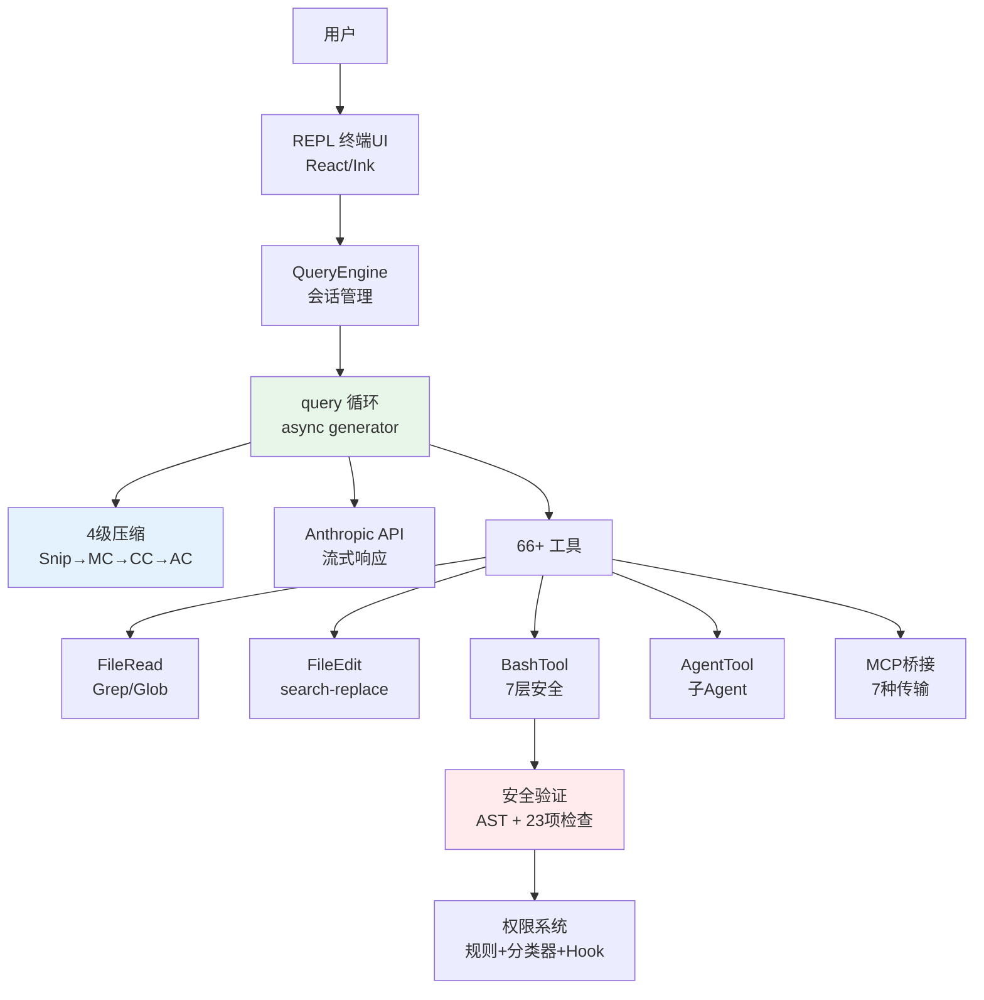

# 10 分钟读懂 Claude Code

> 本文是 Claude Code 源码分析的浓缩版。每个主题都附有深入阅读链接。

## Claude Code 是什么

Claude Code 是 Anthropic 的 CLI 编程 Agent。它不是代码补全工具，而是一个**受控工具循环 Agent**——能理解代码库、编辑文件、执行命令、管理 git 的自主编程助手。

技术栈：TypeScript + Bun + React/Ink（终端 UI） + Anthropic API。源码约 512K+ 行。

> 深入阅读：[概述](./01-overview.md)

---

## 核心：Agent Loop

Claude Code 的灵魂是一个 `while(true)` 循环：

```
用户输入 → 组装上下文 → 调用模型 → 模型决策
  ↓
  有工具调用？ → 执行工具 → 注入结果 → 继续循环
  ↓
  无工具调用？ → 返回文本响应 → 结束
```

实现为 `async function*` 异步生成器，支持真正的流式处理。采用双层架构：

- **QueryEngine**（外层）：管理对话生命周期、持久化、预算检查
- **query()**（内层）：管理单次循环、API 流式、工具执行、错误恢复

query() 有 7 个 Continue Sites，分别处理：正常工具循环、PTL 恢复、输出 Token 升级、反应式压缩等。

核心设计亮点：**错误扣留策略**——可恢复的错误不暴露给调用者，自动修复后继续。

> 深入阅读：[系统主循环](./02-agent-loop.md)

---

## 上下文工程

每次 API 调用的上下文由三部分组成：

1. **系统提示词**：Agent 身份、行为指引、工具描述
2. **系统上下文**：Git 状态（分支、暂存、最近提交）
3. **用户上下文**：CLAUDE.md 项目指令、当前日期

当对话变长，**4 级压缩流水线**逐级启动：

```
Snip（剪裁）→ Microcompact（微压缩）→ Context Collapse（折叠）→ Autocompact（全量摘要）
```

每级成本和效果不同，按需逐级触发。Autocompact 在 Token 使用达到约 87% 时触发，fork 子 Agent 生成对话摘要。

> 深入阅读：[上下文工程](./03-context-engineering.md)

---

## 工具系统

Claude Code 包含 **66+ 内置工具**，全部统一为 `Tool` 接口：

| 核心工具 | 功能 |
|---------|------|
| BashTool | Shell 命令执行（最复杂，7 层安全验证） |
| FileEditTool | search-and-replace 精确编辑 |
| FileReadTool | 文件读取（支持图片/PDF/Jupyter） |
| GrepTool | ripgrep 驱动的内容搜索 |
| AgentTool | 派生子 Agent |

并发规则：**只读工具并行，写入工具串行**。通过 `isReadOnly()` 和 `isConcurrencySafe()` 判断。

MCP 协议扩展支持 7 种传输（stdio/SSE/HTTP/WebSocket/SDK/IDE/Proxy），第三方工具无缝集成。

> 深入阅读：[工具系统](./04-tool-system.md)

---

## 代码编辑策略

核心理念：**低破坏性编辑**。

- **FileEditTool**（首选）：search-and-replace，只修改目标文本
  - 唯一性约束：`old_string` 必须在文件中唯一
  - 抗幻觉：不存在的代码会导致编辑失败
  - Token 高效：只需发送修改点附近的上下文
- **FileWriteTool**（创建新文件）：全文件覆盖写入

编辑前必须先读取文件——不是提示词建议，而是代码层面的强制检查。

> 深入阅读：[代码编辑策略](./05-code-editing-strategy.md)

---

## 权限与安全

纵深防御，5 层保护：

```
Trust Dialog → 权限模式 → 权限规则匹配 → Bash 安全验证(7层) → 用户确认
```

Bash 安全验证最复杂——tree-sitter AST 分析 + 23 项静态检查，覆盖命令注入、环境变量泄露、Shell 元字符等攻击向量。

权限确认使用**竞速机制**：UI 对话框和 ML 分类器同时运行，第一个完成的决定生效。有 200ms 防误触宽限期。

PermissionRequest Hook 是最强的扩展点——可程序化审批、修改工具输入、动态注入权限规则。

> 深入阅读：[权限与安全](./06-permission-security.md)

---

## 用户体验

Claude Code 使用**自研 Ink 渲染器**（React in Terminal，251KB），实现 Web 级终端 UI：

- Yoga Flexbox 布局
- 虚拟滚动大对话列表
- 对象池内存优化（Char/Style/Hyperlink）
- OSC 8 超链接、鼠标追踪、Kitty 键盘协议
- Vim 模式输入

流式输出全链路基于 async generator，每个 Token 实时渲染。工具调用完全透明——用户能看到每一步操作。

> 深入阅读：[用户体验设计](./07-user-experience.md)

---

## 从最小到完整

构建 coding agent 的 **7 个最小必要组件**：

1. Prompt Orchestration（提示词编排）
2. Tool Registry（工具注册表）
3. Agent Loop（代理循环）
4. File Operations（文件操作）
5. Shell Execution（Shell 执行）
6. Edit Strategy（编辑策略）
7. CLI UX（命令行交互）

最小可用版本约 500 行代码。Claude Code 的 512K+ 行覆盖了生产级需求：压缩系统、安全验证、MCP 集成、多 Agent 协调、记忆系统、插件系统等。

从零构建可参考：[claude-code-from-scratch](https://github.com/Windy3f3f3f3f/claude-code-from-scratch)

> 深入阅读：[最小必要组件](./08-minimal-components.md)

---

## 核心架构图



## 关键文件索引

| 文件 | 行数 | 职责 |
|------|------|------|
| `src/query.ts` | 1,728 | 核心查询循环 |
| `src/QueryEngine.ts` | 1,155 | 会话引擎 |
| `src/Tool.ts` | ~400 | 工具接口定义 |
| `src/tools.ts` | ~200 | 工具注册 |
| `src/context.ts` | 190 | 上下文构建 |
| `src/services/api/claude.ts` | 3,419 | API 调用逻辑 |
| `src/services/compact/compact.ts` | 1,705 | 压缩引擎 |
| `src/bootstrap/state.ts` | 1,758 | 全局状态 |
| `src/screens/REPL.tsx` | 895KB | 主交互界面 |

---

*本文档基于 Claude Code 源码分析。完整分析文档见项目根目录。*

*项目地址：[how-claude-code-works](https://github.com/Windy3f3f3f3f/how-claude-code-works) | [claude-code-from-scratch](https://github.com/Windy3f3f3f3f/claude-code-from-scratch)*
